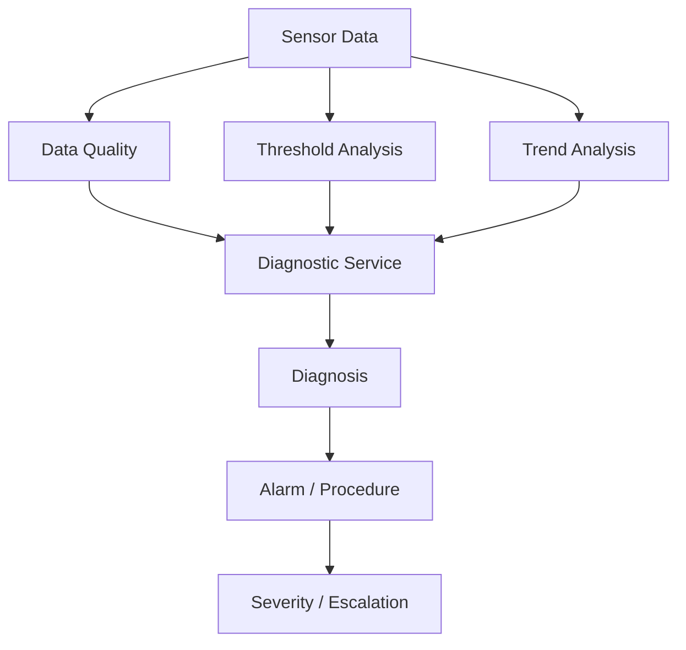
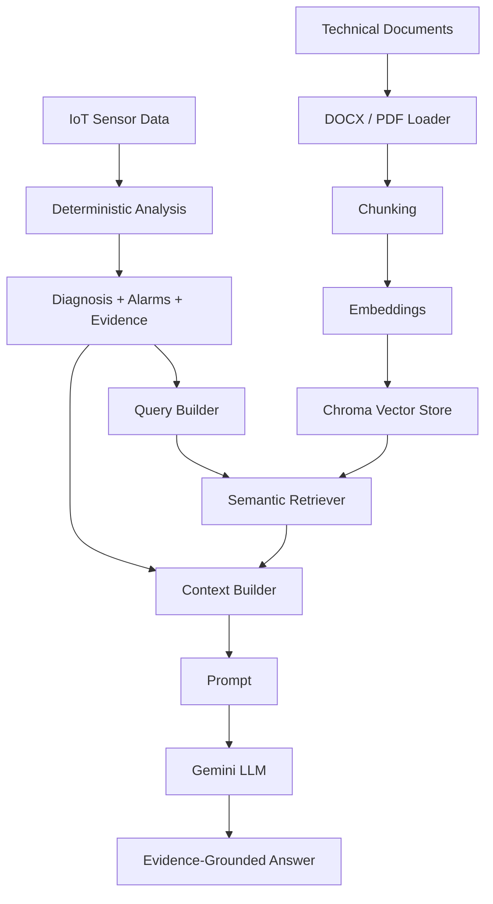

# IoT Maintenance Assistant — Final MVP

> **Durum:** Deterministik IoT analiz çekirdeği, multi-asset yapı, RAG + LLM karar destek hattı, FastAPI Assistant endpoint'i ve React tabanlı görsel arayüz tamamlandı.
>
> **MVP kapsamı:** `PLANT_01 → STATION_01 → MOTOR_A / PUMP_B / VALVE_C`

---

## İçindekiler

1. [Proje Amacı](#1-proje-amacı)
2. [Proje Konumlandırması](#2-proje-konumlandırması)
3. [Varlık Hiyerarşisi](#3-varlık-hiyerarşisi)
4. [Güncel Proje Yapısı](#4-güncel-proje-yapısı)
5. [Deterministik IoT Analiz Akışı](#5-deterministik-iot-analiz-akışı)
6. [Deterministik Backend İşlevleri](#6-deterministik-backend-işlevleri)
7. [Multi-Asset Demo](#7-multi-asset-demo)
8. [RAG Mimarisi](#8-rag-mimarisi)
9. [RAG Bileşenleri](#9-rag-bileşenleri)
10. [Uçtan Uca Sistem Akışı](#10-uçtan-uca-sistem-akışı)
11. [Factory Layout ve Heat Map](#11-factory-layout-ve-heat-map)
12. [Frontend](#12-frontend)
13. [API](#13-api)
14. [Doğrulanan Demo Senaryosu](#14-doğrulanan-demo-senaryosu)
15. [Kurulum](#15-kurulum)
16. [Knowledge Base Indexleme](#16-knowledge-base-indexleme)
17. [Uygulamayı Çalıştırma](#17-uygulamayı-çalıştırma)
18. [Testler](#18-testler)
19. [Geliştirme Durumu](#19-geliştirme-durumu)
20. [Final MVP Durumu](#20-final-mvp-durumu)
21. [MVP Sınırlamaları](#21-mvp-sınırlamaları)
22. [Genel Mimari](#22-genel-mimari)

---

## 1. Proje Amacı

Bu proje; endüstriyel IoT sensör verisini, varlık hiyerarşisini, teknik bakım dokümanlarını ve üretken yapay zekâyı bir araya getirerek **açıklanabilir ve kanıta dayalı bakım karar desteği** sunan bir MVP geliştirmeyi amaçlar.

Temel yaklaşım:

1. Sensör verisini oku.
2. Veri kalitesini doğrula.
3. Eşik ve alarm analizi yap.
4. Sensör trendlerini değerlendir.
5. Çoklu sensör desenlerinden deterministik teşhis üret.
6. Kritik durumlarda prosedür ve eskalasyon belirle.
7. Deterministik analiz sonucunu kullanarak RAG sorgusunu zenginleştir.
8. Teknik dokümanlar, bakım prosedürleri ve geçmiş benzer olaylar arasında semantic search yap.
9. Deterministik analiz ile retrieved kaynakları ortak bir context içinde birleştir.
10. LLM ile kaynaklı ve kanıta dayalı Türkçe cevap üret.

---

## 2. Proje Konumlandırması

Amaç bir IIoT, MES veya SCADA platformunu baştan geliştirmek değildir.

MVP odağı:

> **Asset-context-aware + deterministic-first + evidence-grounded maintenance assistant**

Sistemde LLM doğrudan ham sensör verisinden arıza teşhisi koymaz.

```text
Sensör verisi
      ↓
Deterministik analiz
      ↓
Teşhis + Alarm + Kanıt
      ↓
RAG
      ↓
Teknik kaynaklar
      ↓
LLM açıklaması
```

Sorumluluklar üç katmana ayrılmıştır:

* **Deterministik katman:** sensör değerlerini analiz eder ve teknik durumu belirler.
* **RAG katmanı:** ilgili teknik dokümanları ve geçmiş olayları getirir.
* **LLM katmanı:** mevcut kanıtları kullanıcıya anlaşılır biçimde açıklar.

LLM, deterministik analiz sonucunu değiştiren yeni bir teşhis üretmek için kullanılmaz.

---

## 3. Varlık Hiyerarşisi

```text
PLANT_01
├── STATION_01
│   ├── MOTOR_A
│   ├── PUMP_B
│   └── VALVE_C
└── STATION_02
    └── (placeholder)
```

Varlık ilişkileri `config/assets.yaml` üzerinden tanımlanır.

```text
Plant
  ↓
Station
  ↓
Asset
  ↓
Sensors / Data / Knowledge Base
```

`STATION_01` altında üç farklı varlık tipi bulunmaktadır:

```text
MOTOR_A → electric_motor
PUMP_B  → centrifugal_pump
VALVE_C → control_valve
```

---

## 4. Güncel Proje Yapısı

```text
FINAL_PROJECT/
├── backend/
│   ├── api/
│   │   └── routes/
│   │       ├── assets.py
│   │       ├── machines.py
│   │       ├── analysis.py
│   │       └── assistant.py
│   │
│   ├── core/
│   │   └── config.py
│   │
│   ├── schemas/
│   │   ├── asset.py
│   │   ├── sensor.py
│   │   └── analysis.py
│   │
│   ├── services/
│   │   ├── asset_catalog.py
│   │   ├── asset_service.py
│   │   ├── data_service.py
│   │   ├── data_quality_service.py
│   │   ├── anomaly_service.py
│   │   ├── trend_service.py
│   │   ├── diagnostic_service.py
│   │   └── rag/
│   │       ├── document_loader.py
│   │       ├── chunking_service.py
│   │       ├── embedding_service.py
│   │       ├── vector_store.py
│   │       ├── retriever.py
│   │       ├── query_builder.py
│   │       ├── context_builder.py
│   │       ├── prompt.py
│   │       ├── llm_service.py
│   │       ├── rag_chain.py
│   │       └── rag_service.py
│   │
│   └── main.py
│
├── frontend/
│   ├── public/
│   │   └── factory-layout.svg
│   └── src/
│       ├── api/
│       ├── components/
│       │   └── FactoryLayout.jsx
│       ├── App.jsx
│       └── index.css
│
├── config/
│   ├── assets.yaml
│   ├── thresholds.yaml
│   └── data_quality.yaml
│
├── data/
│   └── PLANT_01/
│       └── STATION_01/
│           ├── MOTOR_A/
│           ├── PUMP_B/
│           └── VALVE_C/
│
├── knowledge_base/
│   └── PLANT_01/
│       └── STATION_01/
│           ├── MOTOR_A/
│           ├── PUMP_B/
│           └── VALVE_C/
│
├── scripts/
│   └── index_multi_asset_kb.py
│
├── storage/
│   └── chroma/
│
├── tests/
├── .env.example
├── .gitignore
├── README.md
└── requirements.txt
```

---

## 5. Deterministik IoT Analiz Akışı



Metin görünümü:

```text
Sensor Data
    ↓
Data Quality
    ↓
Threshold Analysis
    ↓
Trend Analysis
    ↓
Multi-Sensor Diagnosis
    ↓
Alarm + Procedure
    ↓
Severity / Escalation
```

---

## 6. Deterministik Backend İşlevleri

### Asset Service

* Plant bilgisi
* Station bilgisi
* Station altındaki varlıklar
* Asset → Station → Plant ilişkisi
* Cached asset catalog
* Data ve knowledge base path çözümleme
* Frontend için hierarchy endpoint'i
* Spatial koordinatların taşınması

### Data Service

* CSV sensör verisi okuma
* Son ölçüm
* Geçmiş ölçümler
* Belirli timestamp etrafında gerçek zaman tabanlı pencere sorgusu
* Ground-truth alanlarını runtime analiz girdisinden ayırma

### Data Quality

Desteklenen örnek veri kalitesi durumları:

```text
DQ-SPIKE-01
DQ-STUCK-01
DQ-MISS-01
```

Data-quality kontrolleri asset konfigürasyonuna göre uygulanır.

### Threshold / Alarm

Motor-A demo eşikleri:

```text
Temperature
<70 normal | 70–<80 warning | ≥80 critical

Vibration
<3.5 normal | 3.5–<6 warning | ≥6 critical

Current
<19 normal | 19–<22 warning | ≥22 critical

Load
35–92 normal | >92 warning | ≥105 critical
```

> Bu eşikler gerçek üretici spesifikasyonları değildir. MVP ve sentetik veri senaryosu için tanımlanmıştır.

PUMP_B ve VALVE_C için gerekli sensörlere özel threshold konfigürasyonları ayrıca tanımlanmıştır.

### Trend Analysis

İzlenen ortak değişkenler:

* temperature
* vibration
* current
* load
* power

Trend sonuçları:

```text
increasing
stable
decreasing
unknown / insufficient_data
```

### Diagnostic Service

Motor-A için tanımlı deterministik desenler:

```text
cooling_degradation
bearing_degradation
overload
```

Kritik Motor-A durumlarında `MNT-MA-007` eskalasyonu üretilebilir.

Farklı asset tiplerinde desteklenmeyen fiziksel teşhislerin uydurulması yerine güvenli `no_pattern` davranışı tercih edilir.

---

## 7. Multi-Asset Demo

`STATION_01` altında üç farklı varlık bulunmaktadır:

```text
MOTOR_A → electric_motor
PUMP_B  → centrifugal_pump
VALVE_C → control_valve
```

Her varlığın kendi:

* sensör verisi,
* threshold konfigürasyonu,
* data-quality gereksinimleri,
* knowledge base'i,
* spatial koordinatı

bulunur.

Örnek süreç ilişkisi:

```text
MOTOR_A → PUMP_B → VALVE_C → PROCESS_OUT
```

Spatial koordinatlar yüzde tabanlıdır ve frontend factory layout üzerinde responsive biçimde kullanılır.

---

## 8. RAG Mimarisi



Klasik RAG:

```text
User Question
    ↓
Retriever
```

Bu projede:

```text
User Question
      +
Deterministic Analysis
      +
Diagnosis
      +
Alarms
      +
Procedure Codes
      +
Sensor Evidence
      ↓
Retriever
```

Bu sayede retrieval sorgusu yalnızca kullanıcı sorusuna değil, mevcut IoT durumuna da dayanır.

---

## 9. RAG Bileşenleri

### 9.1 Document Loader

Desteklenen formatlar:

```text
DOCX
PDF
```

DOCX belgelerinde paragraf ve tablolar okunur.

PDF belgelerinde sayfa bazlı yükleme yapılır ve sayfa metadata'sı korunur.

Image-only / scanned PDF belgeleri mevcut MVP kapsamında OCR ile işlenmez.

Her asset için beş teknik doküman kategorisi kullanılır:

```text
01_ → technical_manual
02_ → alarm_catalog
03_ → maintenance_procedure
04_ → troubleshooting_guide
05_ → incident_history
```

Doküman ID'leri asset kimliğinden otomatik türetilir.

Örnek:

```text
MOTOR_A
MA-MAN-001
MA-ALM-001
MA-MNT-001
MA-TRB-001
MA-INC-001

PUMP_B
PB-MAN-001
PB-ALM-001
PB-MNT-001
PB-TRB-001
PB-INC-001

VALVE_C
VC-MAN-001
VC-ALM-001
VC-MNT-001
VC-TRB-001
VC-INC-001
```

#### Metadata

Örnek:

```json
{
  "plant_id": "PLANT_01",
  "station_id": "STATION_01",
  "machine_id": "PUMP_B",
  "asset_type": "centrifugal_pump",
  "document_id": "PB-MNT-001",
  "document_type": "maintenance_procedure",
  "source": "03_Pump-B_Bakim_ve_Ilk_Mudahale_Prosedurleri.docx",
  "page_number": null,
  "chunk_id": "PB-MNT-001_CHUNK_0001"
}
```

### 9.2 Chunking

Dokümanlar `RecursiveCharacterTextSplitter` ile parçalanır.

```text
chunk_size    = 900
chunk_overlap = 150
```

Chunk ID örnekleri:

```text
PB-MNT-001_CHUNK_0001
VC-MNT-001_CHUNK_0003
MA-INC-001_CHUNK_0002
```

### 9.3 Embedding

Kullanılan local multilingual embedding modeli:

```text
sentence-transformers/paraphrase-multilingual-MiniLM-L12-v2
```

Embedding'ler normalize edilir.

Embedding modelinin aynı process içinde tekrar tekrar yüklenmesini önlemek için cache kullanılır.

### 9.4 Vector Store

Vector store:

```text
Chroma
```

Persistent storage:

```text
storage/chroma/
```

Collection:

```text
iot_maintenance_kb
```

Multi-asset bilgi tabanında doğrulanan ek chunk sayıları:

```text
PUMP_B  → 29 chunk
VALVE_C → 28 chunk
Toplam  → 57 yeni chunk
```

Retrieval sırasında `machine_id` metadata filtresi uygulanır.

Doğrulanan davranış:

```text
MOTOR_A → yalnız MA-* kaynakları
PUMP_B  → yalnız PB-* kaynakları
VALVE_C → yalnız VC-* kaynakları
```

Bu sayede farklı asset'lerin bilgi tabanları birbirine karışmaz.

### 9.5 Deterministic-Aware Query Builder

Kullanıcı sorusu retrieval öncesinde deterministik analiz bilgileriyle zenginleştirilir.

Örnek:

```text
Motor-A neden kritik durumda ve hangi bakım işlemleri yapılmalı?

Overall status: critical
Diagnosis: bearing_degradation
Confidence: high
Active alarms: ALM-TEMP-01, ALM-VIB-02, ALM-COMB-BRG-01
Recommended procedure: MNT-MA-002
Escalation procedure: MNT-MA-007
Evidence:
temperature increasing
vibration increasing
vibration 8.231 mm/s
```

### 9.6 Context Builder

Context builder üç ana bilgi grubunu birleştirir:

```text
Asset Context
      +
Deterministic Analysis
      +
Retrieved Knowledge
```

Örnek yapı:

```text
=== USER QUESTION ===

...

=== MACHINE CONTEXT ===

Plant
Station
Asset
Asset Type

=== DETERMINISTIC ANALYSIS ===

Diagnosis
Alarms
Procedure
Escalation
Sensor Evidence

=== RETRIEVED KNOWLEDGE ===

Document ID
Document Type
Chunk ID
Source
Content
```

### 9.7 Prompt Guardrails

LLM için kullanılan prompt şu prensipleri uygular:

* Deterministik analiz birincil teknik gerçek kabul edilir.
* LLM yeni bir arıza teşhisi üretmez.
* Retrieved dokümanlar teşhisi değiştirmek için değil, açıklamak ve desteklemek için kullanılır.
* Dokümanda bulunmayan üretici bilgisi, limit veya prosedür uydurulmaz.
* Güvenilir olmayan veride kesin fiziksel arıza iddiası yapılmaz.
* Kritik durumda insan onayı olmadan fiziksel kontrol komutu önerilmez.
* Mevcut sensör değerleri retrieved dokümanlara yanlış biçimde kaynaklandırılmaz.
* Teknik kaynaklar `Document ID` ve `Chunk ID` ile gösterilir.

### 9.8 LLM

LLM katmanı LangChain üzerinden oluşturulur.

Varsayılan model:

```text
google_genai:gemini-3.5-flash-lite
```

Model environment variable üzerinden değiştirilebilir:

```text
RAG_MODEL
```

Akış:

```text
ChatPromptTemplate
        ↓
Gemini
        ↓
StrOutputParser
        ↓
Türkçe cevap
```

---

## 10. Uçtan Uca Sistem Akışı

```text
Asset + Timestamp + Question
            ↓
      Sensor History
            ↓
      Data Quality
            ↓
    Threshold Analysis
            ↓
      Trend Analysis
            ↓
  Deterministic Diagnosis
            ↓
Diagnosis + Alarm + Procedure
            ↓
Deterministic-Aware Query
            ↓
     Semantic Retrieval
            ↓
Technical Documents
+
Historical Incidents
            ↓
      Context Builder
            ↓
          Prompt
            ↓
           LLM
            ↓
Evidence-Grounded AI Answer
            ↓
        React UI
```

---

## 11. Factory Layout ve Heat Map

Frontend içerisinde fabrika yerleşimi üzerinde asset konumları gösterilir.

Desteklenen görünüm modları:

```text
Genel Durum
Sıcaklık
Titreşim
```

Durum renkleri:

```text
Yeşil   → Normal
Sarı    → Uyarı
Kırmızı → Kritik
Gri     → Veri yok
```

Örneğin titreşim sensörü bulunmayan bir asset için `Titreşim` görünümünde sistem gri durum gösterir ve desteklenmeyen sensörü kritik veya normal olarak varsaymaz.

Layout üzerindeki bir asset seçildiğinde dashboard bağlamı da ilgili asset'e geçirilir.

---

## 12. Frontend

React + Vite tabanlı dashboard aşağıdaki özellikleri içerir:

* Plant → Station → Asset navigation
* Dinamik asset dropdown
* Asset detail
* Deterministik durum kartları
* Veri kalitesi görünümü
* Alarm görünümü
* Bakım prosedürü ve eskalasyon kartları
* Sensör zaman serisi grafikleri
* Factory Layout
* Spatial asset marker'ları
* Heat Map
* Genel Durum / Sıcaklık / Titreşim modları
* AI Maintenance Assistant
* Markdown LLM yanıtları
* Retrieved source kartları
* Document ID / Chunk ID kaynak gösterimi

---

## 13. API

Swagger:

```text
http://127.0.0.1:8000/docs
```

### System

```http
GET /
GET /health
```

### Assets

```http
GET /api/v1/plants/{plant_id}
GET /api/v1/plants/{plant_id}/stations
GET /api/v1/plants/{plant_id}/hierarchy
GET /api/v1/stations/{station_id}
GET /api/v1/stations/{station_id}/machines
```

### Machines

```http
GET /api/v1/machines/{machine_id}
GET /api/v1/machines/{machine_id}/latest
```

### Analysis

```http
GET /api/v1/machines/{machine_id}/analysis/latest
GET /api/v1/machines/{machine_id}/data-quality/latest
GET /api/v1/machines/{machine_id}/data-quality/at
GET /api/v1/machines/{machine_id}/trends/at
GET /api/v1/machines/{machine_id}/diagnostics/at
GET /api/v1/machines/{machine_id}/measurements/at
```

### Assistant

```http
POST /api/v1/machines/{machine_id}/assistant
```

Request body örneği:

```json
{
  "question": "Pompanın bakımında hangi kontroller yapılmalı?",
  "timestamp": "2026-07-27 20:00:00",
  "window_minutes": 300,
  "top_k": 5
}
```

Endpoint şu akışı çalıştırır:

```text
Deterministic Analysis
        +
Machine-filtered RAG
        +
Prompt Guardrails
        ↓
Evidence-Grounded Answer
```

---

## 14. Doğrulanan Demo Senaryosu

Ana demo timestamp'i:

```text
2026-07-27 20:00:00
```

Trend penceresi:

```text
300 dakika
```

### MOTOR_A

```text
Data Quality: ok
Overall Status: critical
Diagnosis: bearing_degradation
Confidence: high

Active Alarms:
- ALM-TEMP-01
- ALM-VIB-02
- ALM-COMB-BRG-01

Temperature: 79.20 °C
Vibration: 8.231 mm/s

Recommended Procedure:
MNT-MA-002

Escalation:
MNT-MA-007
```

### PUMP_B

Aynı timestamp'te:

```text
Data Quality: ok
Overall Status: normal
Diagnosis: no_pattern
Temperature: 55.09 °C
Vibration: 2.445 mm/s
```

RAG doğrulaması:

```text
PUMP_B → yalnız PB-* kaynakları
```

Örnek retrieval:

```text
PB-MNT-001
PB-ALM-001
```

### VALVE_C

Aynı timestamp'te:

```text
Data Quality: ok
Overall Status: normal
Diagnosis: no_pattern
Temperature: 42.67 °C
Current: 0.674 A
```

Valve C'de titreşim ölçümü bulunmadığında sistem `vibration → insufficient_data / unknown` olarak davranır.

RAG doğrulaması:

```text
VALVE_C → yalnız VC-* kaynakları
```

---

## 15. Kurulum

### Virtual Environment

Windows:

```powershell
python -m venv .venv
.venv\Scripts\Activate.ps1
```

Bağımlılıkları yükle:

```powershell
pip install -r requirements.txt
```

### Environment Variables

`.env.example` dosyasını `.env` olarak kopyala:

```powershell
Copy-Item .env.example .env
```

Örnek:

```env
GOOGLE_API_KEY=your_google_api_key_here
RAG_MODEL=google_genai:gemini-3.5-flash-lite
```

> Gerçek API key Git repository'sine eklenmemelidir.

---

## 16. Knowledge Base Indexleme

PUMP_B ve VALVE_C dokümanlarını Chroma vector store'a eklemek için:

```powershell
python -m scripts.index_multi_asset_kb
```

Doğrulanan çıktı:

```text
PUMP_B: 5 doküman, 29 chunk hazırlandı.
VALVE_C: 5 doküman, 28 chunk hazırlandı.

Toplam 57 chunk Chroma vector store'a eklendi.
```

---

## 17. Uygulamayı Çalıştırma

### Backend

```powershell
cd C:\Users\Casper\Documents\GitHub\Final_Project

.venv\Scripts\Activate.ps1

uvicorn backend.main:app --reload
```

Backend:

```text
http://127.0.0.1:8000
```

Swagger:

```text
http://127.0.0.1:8000/docs
```

Health check:

```text
http://127.0.0.1:8000/health
```

### Frontend

Yeni terminal:

```powershell
cd C:\Users\Casper\Documents\GitHub\Final_Project\frontend

npm run dev
```

Frontend:

```text
http://localhost:5173
```

### Production Build

```powershell
cd frontend
npm run build
```

Build sırasında bundle-size uyarısı görülebilir. Bu mevcut MVP için hata değildir.

---

## 18. Testler

Backend regression testleri:

```powershell
python -m pytest -v
```

Son doğrulama:

```text
19 passed
2 dependency deprecation warnings
```

Test kapsamındaki başlıca kontroller:

* time-based measurement window
* known overload diagnosis regression
* missing sensor → unreliable data
* invalid timestamp error contract
* non-positive window rejection
* unknown asset 404
* trend ve diagnostic time-window kullanımı
* asset catalog cache
* cached catalog mutation protection
* multi-asset station listing
* hierarchy endpoint
* parent IDs
* critical escalation
* health endpoint

---

## 19. Geliştirme Durumu

### Backend Foundation

- [x] FastAPI
- [x] `/health`
- [x] Modüler router yapısı
- [x] Service katmanı
- [x] Core config
- [x] Pydantic schemas
- [x] Swagger

### Asset Hierarchy

- [x] `PLANT_01`
- [x] `STATION_01`
- [x] `STATION_02`
- [x] `MOTOR_A`
- [x] `PUMP_B`
- [x] `VALVE_C`
- [x] Cached asset catalog
- [x] Asset hierarchy API
- [x] Spatial positions

### Sensor Data

- [x] CSV
- [x] Excel reference dataset
- [x] Latest measurement
- [x] Historical timestamp query
- [x] Time-based measurement window
- [x] Multi-asset data paths

### Data Quality

- [x] Missing
- [x] Stuck
- [x] Spike
- [x] Asset-specific required fields

### Threshold / Trend / Diagnosis

- [x] Temperature threshold
- [x] Vibration threshold
- [x] Current threshold
- [x] Load threshold
- [x] Trend service
- [x] Cooling degradation
- [x] Bearing degradation
- [x] Overload
- [x] Critical escalation
- [x] Safe `no_pattern` fallback

### RAG

- [x] DOCX loader
- [x] PDF loader
- [x] PDF page metadata
- [x] Generic multi-asset document metadata
- [x] Chunking
- [x] Local multilingual embedding
- [x] Embedding cache
- [x] Chroma vector store
- [x] Chroma persistence
- [x] Semantic retrieval
- [x] `machine_id` filtering
- [x] Deterministic-aware query builder
- [x] Context builder
- [x] Prompt guardrails
- [x] Gemini integration
- [x] Evidence-grounded answer
- [x] Document / Chunk attribution
- [x] Multi-asset knowledge-base indexing

### API / Assistant

- [x] Assistant endpoint
- [x] Deterministic analysis context
- [x] RAG retrieval
- [x] LLM answer
- [x] Structured sources
- [x] Multi-asset source isolation

### Frontend / Layout

- [x] Plant → Station → Asset navigation
- [x] Asset detail
- [x] Sensor charts
- [x] Status / alarm cards
- [x] Chat assistant
- [x] RAG source attribution
- [x] Factory layout
- [x] Spatial asset positioning
- [x] Heat Map
- [x] Genel Durum / Sıcaklık / Titreşim modları
- [x] Asset click → selected context
- [x] Multi-asset sidebar
- [x] Dynamic asset dropdown
- [x] Unsupported sensor → Veri yok

### Optional / Advanced

- [ ] Database
- [ ] Real IoT API
- [ ] Streaming
- [ ] Maintenance ticket creation
- [ ] OCR for scanned PDFs
- [ ] Hybrid search
- [ ] Re-ranking
- [ ] Agent orchestration
- [ ] 3D factory view
- [ ] Fully generic asset-type diagnostic rule engine

---

## 20. Final MVP Durumu

| Bileşen | Durum |
|---|---|
| Asset Catalog / Hierarchy | ✅ |
| Multi-Asset Support | ✅ |
| Deterministic IoT Analysis | ✅ |
| Data Quality | ✅ |
| Threshold Analysis | ✅ |
| Trend Analysis | ✅ |
| Deterministic Diagnosis | ✅ |
| RAG Retrieval | ✅ |
| Machine Metadata Filtering | ✅ |
| Gemini LLM | ✅ |
| Evidence-Grounded Answers | ✅ |
| FastAPI Assistant Endpoint | ✅ |
| React Dashboard | ✅ |
| Factory Layout | ✅ |
| Heat Map | ✅ |
| Regression Tests | ✅ 19/19 |
| Frontend Production Build | ✅ |

---

## 21. MVP Sınırlamaları

Bu proje bir demonstrasyon ve bakım karar destek MVP'sidir.

* Sensör verileri sentetiktir.
* Teknik dokümanlar demo amaçlı hazırlanmıştır.
* Threshold değerleri gerçek üretici limitleri değildir.
* Fiziksel ekipman kontrolü gerçekleştirilmez.
* Kritik bakım kararları insan onayına bırakılır.
* LLM deterministik teşhisin yerine geçmez.
* OCR desteklenmez.
* Hybrid retrieval ve re-ranking eklenmemiştir.
* 3D fabrika görünümü MVP kapsamı dışındadır.
* Farklı asset türleri için tüm fiziksel arıza teşhisleri henüz generik hale getirilmemiştir.

---

## 22. Genel Mimari

```text
Factory / Asset Context
          ↓
     Sensor Data
          ↓
 Deterministic Analysis
          ↓
 Diagnosis + Evidence
          ↓
         RAG
          ↓
Technical Documentation
+
Historical Incidents
          ↓
Evidence-Grounded AI Answer
          ↓
       FastAPI
          ↓
     React Dashboard
          ↓
 Factory Layout / Heat Map
```

---

*Last updated: 14 August 2026*