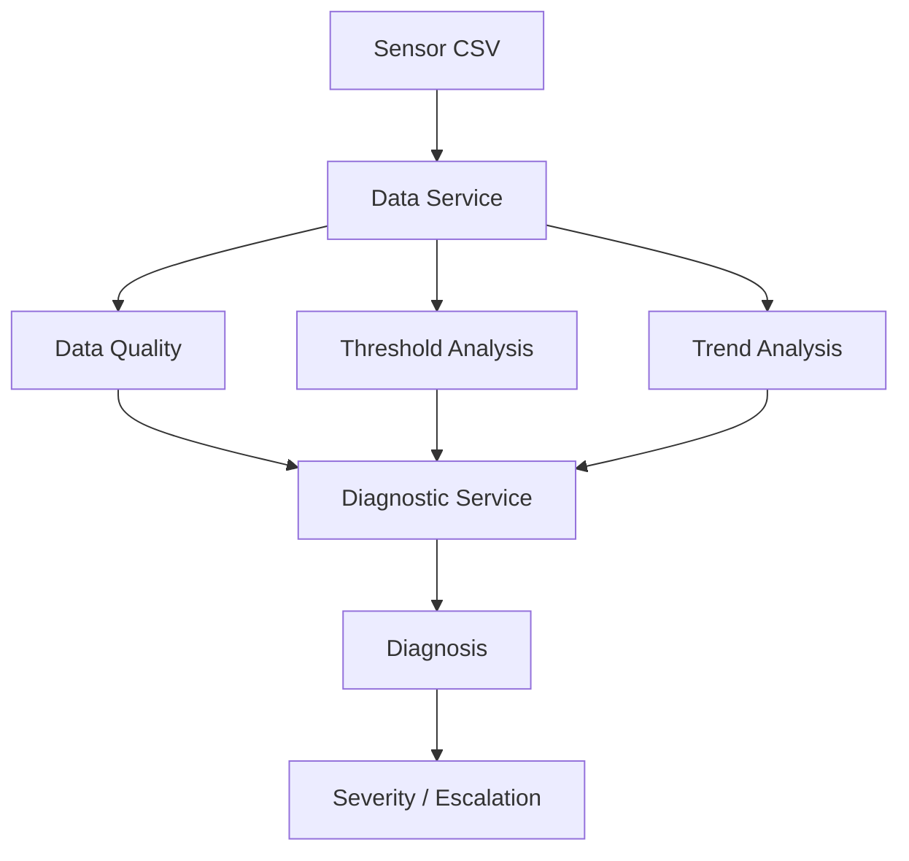
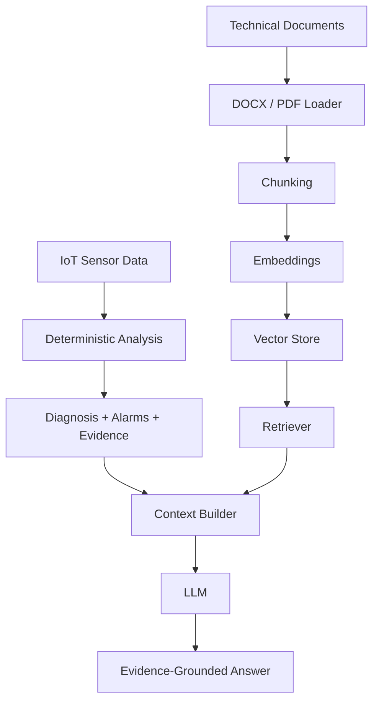

# IoT Maintenance Assistant — MVP

> **Durum:** Deterministik IoT analiz çekirdeği tamamlandı.  
> **Sıradaki ana aşama:** RAG bilgi erişim katmanı.  
> **MVP kapsamı:** `PLANT_01 → STATION_01 → MOTOR_A`

## 1. Proje Amacı

Bu proje, endüstriyel IoT sensör verisini, varlık hiyerarşisini ve teknik bakım dokümanlarını bir araya getirerek açıklanabilir bakım karar desteği sunan bir MVP geliştirmeyi amaçlar.

Temel yaklaşım:

1. Sensör verisini oku.
2. Veri kalitesini doğrula.
3. Eşik analizi yap.
4. Trendleri değerlendir.
5. Çoklu sensör desenlerinden deterministik teşhis üret.
6. Kritik durumlarda eskalasyon belirle.
7. RAG ile ilgili teknik doküman, bakım prosedürü ve geçmiş olayı getir.
8. LLM ile kanıta dayalı kullanıcı cevabı üret.
9. Daha sonra sonucu fabrika layout'u üzerinde mekânsal olarak göster.

## 2. Proje Konumlandırması

Amaç bir IIoT platformunu baştan geliştirmek değildir.

MVP odağı:

**Asset-context-aware + deterministic-first + evidence-grounded maintenance assistant**

LLM doğrudan arıza teşhisi koymaz. Önce deterministik katman kanıt üretir; RAG/LLM bu sonucu teknik dokümanlarla açıklar.

## 3. Varlık Hiyerarşisi

```text
PLANT_01
├── STATION_01
│   └── MOTOR_A
└── STATION_02
    └── (MVP'de henüz makine yok)
```

Bu hiyerarşi `config/assets.yaml` üzerinden tanımlanır.

## 4. Mevcut Proje Yapısı

```text
FINAL_PROJECT/
├── backend/
│   ├── api/routes/
│   │   ├── assets.py
│   │   ├── machines.py
│   │   └── analysis.py
│   ├── core/
│   │   └── config.py
│   ├── schemas/
│   │   ├── asset.py
│   │   ├── sensor.py
│   │   └── analysis.py
│   ├── services/
│   │   ├── asset_service.py
│   │   ├── data_service.py
│   │   ├── data_quality_service.py
│   │   ├── anomaly_service.py
│   │   ├── trend_service.py
│   │   └── diagnostic_service.py
│   └── main.py
├── config/
│   ├── assets.yaml
│   ├── thresholds.yaml
│   └── data_quality.yaml
├── data/
│   └── PLANT_01/STATION_01/MOTOR_A/
│       ├── motor_a_dummy_sensor_data.csv
│       └── motor_a_dummy_dataset.xlsx
├── knowledge_base/
│   └── PLANT_01/STATION_01/MOTOR_A/
│       ├── 01_Motor-A_Teknik_Kullanim_ve_Izleme_Kilavuzu.docx
│       ├── 02_Motor-A_Alarm_ve_Veri_Kalitesi_Katalogu.docx
│       ├── 03_Motor-A_Bakim_ve_Ilk_Mudahale_Prosedurleri.docx
│       ├── 04_Motor-A_Ariza_Teshis_ve_Yonlendirme_Rehberi.docx
│       └── 05_Motor-A_Gecmis_Olay_ve_Bakim_Kayitlari.docx
├── tests/
├── .gitignore
└── requirements.txt
```

> `backend/services/rag/` henüz oluşturulmadı. RAG geliştirme aşamasında eklenecek.

## 5. Mevcut Çalışan Akış



Metin görünümü:

```text
Sensor Data
    ↓
Data Quality
    ↓
Threshold Analysis
    ↓
Trend Analysis
    ↓
Multi-Sensor Diagnosis
    ↓
Severity / Escalation
```

## 6. Hedef RAG + AI Akışı



## 7. Mevcut Backend İşlevleri

### Asset Service
- Plant bilgisi
- Station bilgisi
- Station altındaki makineler
- Machine → Station → Plant ilişkisi
- Data / knowledge base path çözümleme

### Data Service
- CSV okuma
- Son ölçüm
- Son N ölçüm
- Belirli timestamp'e kadar geçmiş ölçümler

### Data Quality
- `DQ-SPIKE-01`
- `DQ-STUCK-01`
- `DQ-MISS-01`

### Threshold / Alarm
Motor-A demo eşikleri:

```text
Temperature
<70 normal | 70–<80 warning | ≥80 critical

Vibration
<3.5 normal | 3.5–<6 warning | ≥6 critical

Current
<19 normal | 19–<22 warning | ≥22 critical

Load
35–92 normal | >92 warning | ≥105 critical
```

### Trend
- temperature
- vibration
- current
- load
- power

Çıktılar:
`increasing / stable / decreasing`

### Diagnostic
- `cooling_degradation`
- `bearing_degradation`
- `overload`
- critical escalation → `MNT-MA-007`

## 8. Doğrulanan Sentetik Olaylar

| Incident | Beklenen Sonuç | Durum |
|---|---|---|
| INC-MA-001 | cooling_degradation | ✅ |
| INC-MA-002 | bearing_degradation | ✅ |
| INC-MA-003 | overload | ✅ |
| INC-MA-004 | DQ-SPIKE-01 | ✅ |
| INC-MA-005 | DQ-STUCK-01 | ✅ |
| INC-MA-006 | DQ-MISS-01 | ✅ |
| INC-MA-007 | critical bearing + escalation | ✅ |

## 9. API

Swagger:

```text
http://127.0.0.1:8000/docs
```

### System
```text
GET /
GET /health
```

### Assets
```text
GET /api/v1/plants/{plant_id}
GET /api/v1/plants/{plant_id}/stations
GET /api/v1/stations/{station_id}
GET /api/v1/stations/{station_id}/machines
```

### Machines
```text
GET /api/v1/machines/{machine_id}
GET /api/v1/machines/{machine_id}/latest
```

### Analysis
```text
GET /api/v1/machines/{machine_id}/analysis/latest
GET /api/v1/machines/{machine_id}/data-quality/latest
GET /api/v1/machines/{machine_id}/data-quality/at
GET /api/v1/machines/{machine_id}/trends/at
GET /api/v1/machines/{machine_id}/diagnostics/at
```

## 10. RAG Planı — Sıradaki Aşama

LangChain yalnızca RAG / LLM orkestrasyonu tarafında kullanılacak. Deterministik IoT analizi saf Python/FastAPI servislerinde kalacak.

Planlanan yapı:

```text
backend/services/rag/
├── __init__.py
├── document_loader.py
├── chunking_service.py
├── vector_store.py
├── retriever.py
└── rag_service.py
```

RAG'de desteklenecek dosya türleri:

```text
DOCX
PDF
```

Her chunk'ın taşıması planlanan metadata:

```json
{
  "plant_id": "PLANT_01",
  "station_id": "STATION_01",
  "machine_id": "MOTOR_A",
  "asset_type": "electric_motor",
  "document_id": "MA-MNT-001",
  "document_type": "maintenance_procedure",
  "source": "...",
  "page_number": 3
}
```

## 11. Geliştirme Checklist

### Backend Foundation
- [x] FastAPI
- [x] `/health`
- [x] Modüler router yapısı
- [x] Service katmanı
- [x] Core config
- [x] Pydantic schemas
- [x] Swagger gruplaması

### Asset Hierarchy
- [x] PLANT_01
- [x] STATION_01
- [x] MOTOR_A
- [x] STATION_02 placeholder
- [x] assets.yaml
- [x] Asset API

### Sensor Data
- [x] CSV
- [x] Excel reference dataset
- [x] Latest measurement
- [x] Recent measurements
- [x] Historical timestamp query
- [x] Ground-truth alanlarını analiz girdisinden ayırma

### Data Quality
- [x] Missing
- [x] Stuck
- [x] Spike
- [x] INC-MA-004 testi
- [x] INC-MA-005 testi
- [x] INC-MA-006 testi

### Threshold / Trend / Diagnosis
- [x] Temperature threshold
- [x] Vibration threshold
- [x] Current threshold
- [x] Load threshold
- [x] Trend service
- [x] Cooling degradation
- [x] Bearing degradation
- [x] Overload
- [x] Critical escalation
- [x] INC-MA-001
- [x] INC-MA-002
- [x] INC-MA-003
- [x] INC-MA-007

### RAG — NEXT
- [ ] `backend/services/rag/`
- [ ] LangChain bağımlılıkları
- [ ] DOCX loader
- [ ] PDF loader
- [ ] PDF page metadata
- [ ] Image-only PDF davranışı
- [ ] Document metadata
- [ ] Chunking
- [ ] Chunk metadata
- [ ] Embedding model seçimi
- [ ] Vector store seçimi
- [ ] Chroma persistence
- [ ] Retriever
- [ ] Metadata filtering
- [ ] Retrieval testleri
- [ ] Procedure-aware retrieval
- [ ] Incident similarity retrieval
- [ ] Context builder
- [ ] PromptTemplate
- [ ] LCEL / RunnableSequence
- [ ] LLM entegrasyonu
- [ ] Kaynaklı cevap
- [ ] Hallucination guardrails
- [ ] RAG API endpoint

### Frontend / Layout — LATER
- [ ] Plant → Station → Machine navigation
- [ ] Machine detail
- [ ] Sensor charts
- [ ] Status / alarm cards
- [ ] Factory layout upload
- [ ] Station işaretleme
- [ ] Machine işaretleme
- [ ] Heatmap
- [ ] Machine click → diagnosis context
- [ ] Chat assistant
- [ ] RAG kaynak gösterimi

### Optional / Advanced
- [ ] Multi-machine data
- [ ] Multi-station data
- [ ] Database
- [ ] Real IoT API
- [ ] Streaming
- [ ] Maintenance ticket creation
- [ ] OCR for scanned PDFs
- [ ] Hybrid search
- [ ] Re-ranking
- [ ] 3D factory view

## 12. Şu Anda Nerede Kaldık?

**Deterministik analiz pipeline'ı tamamlandı ve 7 sentetik olayla doğrulandı.**

Son tamamlanan test:

```text
INC-MA-007
Temperature: 62.44 → 79.20 °C
Vibration: 3.525 → 8.231 mm/s
Diagnosis: bearing_degradation
Overall: critical
Alarm: ALM-COMB-BRG-01 + ALM-VIB-02
Procedure: MNT-MA-002
Escalation: MNT-MA-007
```

### Sıradaki kesin adım

```text
1. backend/services/rag/ oluştur
2. DOCX + PDF loader
3. LangChain Document
4. Asset metadata
5. Chunking
6. Ingestion test script
```

Henüz:
- embedding,
- vector store,
- retriever,
- LLM

eklenmedi.

## 13. Hedef MVP Akışı

```text
MOTOR_A
   ↓
Sensor Data
   ↓
Data Quality
   ↓
Thresholds
   ↓
Trends
   ↓
Diagnosis
   ↓
Alarm + Procedure + Escalation
   ↓
RAG
   ↓
Relevant Technical Documentation
   ↓
Similar Historical Incident
   ↓
Evidence-Grounded AI Answer
```

Sonraki görsel katman:

```text
Factory Layout
   ↓
Select Machine
   ↓
Analyze
   ↓
Explain
```

---
_Last updated: 11 August 2026_
