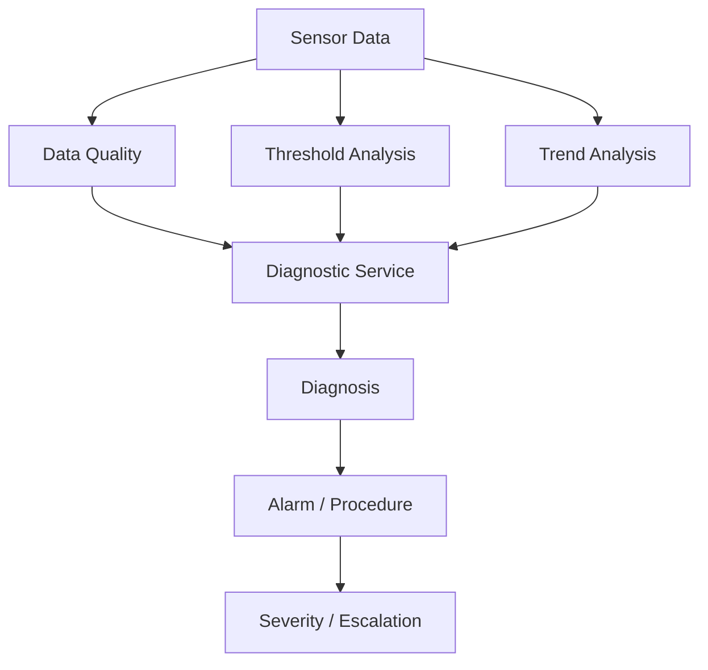
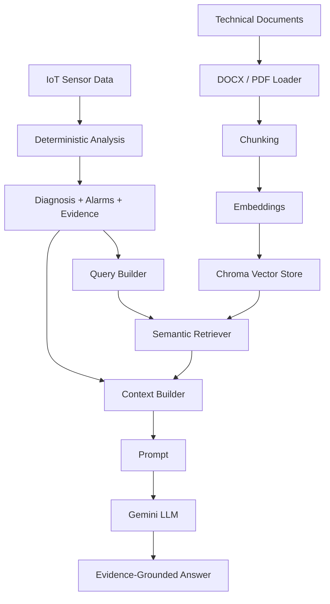

# IoT Maintenance Assistant — Final MVP

> **Durum:** Deterministik IoT analiz çekirdeği, multi-asset yapı, RAG + LLM karar destek hattı, FastAPI API katmanı, Factory Layout / Heat Map ve React tabanlı kullanıcı arayüzü tamamlandı.
>
> **MVP kapsamı:** `PLANT_01 → STATION_01 → MOTOR_A / PUMP_B / VALVE_C`

---

## İçindekiler

1. [Proje Amacı](#1-proje-amacı)
2. [Proje Konumlandırması](#2-proje-konumlandırması)
3. [Varlık Hiyerarşisi](#3-varlık-hiyerarşisi)
4. [Proje Yapısı](#4-proje-yapısı)
5. [Deterministik IoT Analiz Akışı](#5-deterministik-iot-analiz-akışı)
6. [Deterministik Backend İşlevleri](#6-deterministik-backend-işlevleri)
7. [Multi-Asset Yapı](#7-multi-asset-yapı)
8. [RAG Mimarisi](#8-rag-mimarisi)
9. [RAG Bileşenleri](#9-rag-bileşenleri)
10. [Uçtan Uca Sistem Akışı](#10-uçtan-uca-sistem-akışı)
11. [Factory Layout ve Heat Map](#11-factory-layout-ve-heat-map)
12. [Frontend](#12-frontend)
13. [API](#13-api)
14. [Doğrulanan Demo Senaryosu](#14-doğrulanan-demo-senaryosu)
15. [Kurulum](#15-kurulum)
16. [Knowledge Base Indexleme](#16-knowledge-base-indexleme)
17. [Uygulamayı Çalıştırma](#17-uygulamayı-çalıştırma)
18. [Testler](#18-testler)
19. [Geliştirme Durumu](#19-geliştirme-durumu)
20. [Final MVP Durumu](#20-final-mvp-durumu)
21. [MVP Sınırlamaları](#21-mvp-sınırlamaları)
22. [Genel Mimari](#22-genel-mimari)

---

# 1. Proje Amacı

Bu proje; endüstriyel IoT sensör verisini, varlık hiyerarşisini, teknik bakım dokümanlarını ve üretken yapay zekâyı bir araya getirerek **açıklanabilir ve kanıta dayalı bakım karar desteği** sunan bir MVP geliştirmeyi amaçlar.

Sistem temel olarak şu akışı uygular:

1. Sensör verisini okur.
2. Veri kalitesini kontrol eder.
3. Eşik ve alarm analizini gerçekleştirir.
4. Sensör trendlerini değerlendirir.
5. Desteklenen varlık tiplerinde deterministik teşhis üretir.
6. Gerekli durumlarda bakım prosedürü ve eskalasyon bilgisini belirler.
7. Deterministik analiz sonucunu RAG sorgusuna dahil eder.
8. İlgili teknik dokümanlar ve geçmiş bakım kayıtları üzerinde semantic retrieval gerçekleştirir.
9. Deterministik analiz ile retrieved dokümanları ortak bir context içinde birleştirir.
10. LLM aracılığıyla kaynaklı ve kanıta dayalı Türkçe cevap üretir.

---

# 2. Proje Konumlandırması

Bu projenin amacı yeni bir IIoT, MES veya SCADA platformu geliştirmek değildir.

MVP'nin odak noktası:

> **Asset-context-aware + deterministic-first + evidence-grounded maintenance assistant**

Sistemin temel tasarım prensibi, LLM'in ham sensör verisini doğrudan yorumlayarak kendi başına fiziksel arıza teşhisi üretmesini engellemektir.

```text
Sensör Verisi
      ↓
Deterministik Analiz
      ↓
Teşhis + Alarm + Kanıt
      ↓
RAG
      ↓
Teknik Kaynaklar
      ↓
LLM Açıklaması
```

Sorumluluklar üç ana katmana ayrılır:

- **Deterministik katman:** Sensör değerlerini, veri kalitesini, threshold durumlarını ve trendleri değerlendirir.
- **RAG katmanı:** Seçilen asset'e ait ilgili teknik dokümanları getirir.
- **LLM katmanı:** Deterministik sonuçları ve retrieved kaynakları kullanıcıya anlaşılır biçimde açıklar.

LLM, deterministik analiz sonucunun yerine geçen yeni bir fiziksel teşhis üretmek için kullanılmaz.

---

# 3. Varlık Hiyerarşisi

MVP aşağıdaki asset yapısını kullanır:

```text
PLANT_01
├── STATION_01
│   ├── MOTOR_A
│   ├── PUMP_B
│   └── VALVE_C
│
└── STATION_02
    └── (placeholder)
```

Varlık ilişkileri:

```text
Plant
  ↓
Station
  ↓
Asset
  ↓
Sensors / Data / Knowledge Base / Spatial Context
```

Asset kataloğu `config/assets.yaml` üzerinden yönetilir.

`STATION_01` altında üç farklı varlık tipi bulunmaktadır:

```text
MOTOR_A → electric_motor
PUMP_B  → centrifugal_pump
VALVE_C → control_valve
```

Bu yapı sayesinde frontend ve backend doğrudan sabit `machine_id` kontrollerine bağımlı olmadan asset metadata üzerinden çalışabilir.

---

# 4. Proje Yapısı

```text
internship_final_project/
│
├── backend/
│   ├── api/
│   │   └── routes/
│   │       ├── assets.py
│   │       ├── machines.py
│   │       ├── analysis.py
│   │       └── assistant.py
│   │
│   ├── core/
│   │   └── config.py
│   │
│   ├── schemas/
│   │   ├── asset.py
│   │   ├── sensor.py
│   │   └── analysis.py
│   │
│   ├── services/
│   │   ├── asset_catalog.py
│   │   ├── asset_service.py
│   │   ├── data_service.py
│   │   ├── data_quality_service.py
│   │   ├── anomaly_service.py
│   │   ├── trend_service.py
│   │   ├── diagnostic_service.py
│   │   │
│   │   └── rag/
│   │       ├── document_loader.py
│   │       ├── chunking_service.py
│   │       ├── embedding_service.py
│   │       ├── vector_store.py
│   │       ├── retriever.py
│   │       ├── query_builder.py
│   │       ├── context_builder.py
│   │       ├── prompt.py
│   │       ├── llm_service.py
│   │       ├── rag_chain.py
│   │       └── rag_service.py
│   │
│   └── main.py
│
├── frontend/
│   ├── public/
│   │   └── factory-layout.svg
│   │
│   └── src/
│       ├── api/
│       ├── components/
│       │   └── FactoryLayout.jsx
│       ├── App.jsx
│       └── index.css
│
├── config/
│   ├── assets.yaml
│   ├── thresholds.yaml
│   └── data_quality.yaml
│
├── data/
│   └── PLANT_01/
│       └── STATION_01/
│           ├── MOTOR_A/
│           ├── PUMP_B/
│           └── VALVE_C/
│
├── knowledge_base/
│   └── PLANT_01/
│       └── STATION_01/
│           ├── MOTOR_A/
│           ├── PUMP_B/
│           └── VALVE_C/
│
├── scripts/
│   └── index_multi_asset_kb.py
│
├── storage/
│   └── chroma/
│
├── tests/
│
├── .env.example
├── .gitignore
├── pytest.ini
├── README.md
└── requirements.txt
```

---

# 5. Deterministik IoT Analiz Akışı



Metin görünümü:

```text
Sensor Data
    ↓
Data Quality
    ↓
Threshold Analysis
    ↓
Trend Analysis
    ↓
Asset-Type-Aware Diagnosis
    ↓
Alarm + Procedure
    ↓
Severity / Escalation
```

Analizler belirli bir `timestamp` ve `window_minutes` değeri üzerinden gerçekleştirilir.

Dashboard ve RAG Assistant aynı **time-based measurement window** mantığını kullanır.

Bu sayede RAG katmanı sabit örnekleme aralığı veya belirli sayıda son kaydı alma varsayımına bağımlı değildir.

---

# 6. Deterministik Backend İşlevleri

## Asset Service

Asset katmanı şu sorumlulukları taşır:

- Plant bilgisi
- Station bilgisi
- Station altındaki asset'ler
- Asset → Station → Plant ilişkisi
- Cached asset catalog
- Data path çözümleme
- Knowledge base path çözümleme
- Asset metadata
- Parent ID bilgileri
- Spatial koordinatlar
- Frontend hierarchy verisi

Asset katalog sonuçları cache üzerinden okunur ve servis dışındaki mutation işlemlerinin cached katalog yapısını değiştirmemesi sağlanır.

---

## Data Service

Data Service:

- CSV sensör verisini okur.
- Son ölçümü getirir.
- Geçmiş ölçümleri sorgular.
- Timestamp bazlı ölçüm sorgusu gerçekleştirir.
- Belirlenen zaman aralığındaki ölçümleri getirir.
- Ground-truth / demo amaçlı alanları runtime analiz girdisinden ayırır.

Time-based window mantığı:

```text
timestamp = T
window_minutes = W

başlangıç = T - W

başlangıç <= measurement_timestamp <= T
```

Başlangıç ve bitiş zamanları pencereye dahildir.

Bu yaklaşım örnekleme frekansından bağımsızdır.

---

## Data Quality

Desteklenen örnek veri kalitesi durumları:

```text
DQ-SPIKE-01
DQ-STUCK-01
DQ-MISS-01
```

Data-quality kontrolleri asset konfigürasyonuna ve gerekli sensör alanlarına göre uygulanır.

Veri güvenilir değilse sistem kesin fiziksel arıza teşhisi üretmek yerine:

```text
status = conditional
confidence = low
```

davranışına geçer.

---

## Threshold / Alarm

Motor-A demo eşikleri:

```text
Temperature
<70 normal | 70–<80 warning | ≥80 critical

Vibration
<3.5 normal | 3.5–<6 warning | ≥6 critical

Current
<19 normal | 19–<22 warning | ≥22 critical

Load
35–92 normal | >92 warning | ≥105 critical
```

> Bu eşikler gerçek üretici spesifikasyonları değildir. MVP ve sentetik demo senaryosu için tanımlanmıştır.

`PUMP_B` ve `VALVE_C` için ilgili sensör yapılarına uygun threshold konfigürasyonları ayrıca bulunmaktadır.

---

## Trend Analysis

İzlenen ortak değişkenler:

- temperature
- vibration
- current
- load
- power

Olası trend sonuçları:

```text
increasing
stable
decreasing
unknown
insufficient_data
```

Trend analizi kayıt sayısı yerine seçilen gerçek zaman penceresi içerisindeki ölçümler üzerinde çalışır.

---

## Diagnostic Service

Motor tipi asset'ler için MVP kapsamında tanımlanan deterministik fiziksel teşhis desenleri:

```text
cooling_degradation
bearing_degradation
overload
```

Kritik Motor-A durumlarında ilgili bakım prosedürlerine ek olarak:

```text
MNT-MA-007
```

eskalasyon prosedürü üretilebilir.

### Asset-Type Diagnostic Guard

Fiziksel teşhis kuralları `machine_id` yerine asset tipine göre uygulanır.

```text
electric_motor
    ↓
bearing / overload / cooling diagnosis rules

centrifugal_pump
    ↓
no_pattern

control_valve
    ↓
no_pattern
```

Bu nedenle `PUMP_B` veya `VALVE_C` kritik durumda olsa bile Motor-A'ya ait:

```text
MNT-MA-001
MNT-MA-002
MNT-MA-003
MNT-MA-007
```

prosedürleri yanlışlıkla üretilmez.

Desteklenmeyen asset tipleri için güvenli davranış:

```text
status = no_pattern
diagnosis = None
recommended_procedure = None
escalation_procedure = None
```

şeklindedir.

Bu yaklaşım, farklı asset tipleri için henüz tanımlanmamış fiziksel teşhislerin sistem tarafından uydurulmasını engeller.

---

# 7. Multi-Asset Yapı

`STATION_01` altında üç farklı asset bulunur:

```text
MOTOR_A → electric_motor
PUMP_B  → centrifugal_pump
VALVE_C → control_valve
```

Her asset'in kendi:

- sensör verisi,
- threshold konfigürasyonu,
- data-quality gereksinimleri,
- knowledge base'i,
- asset metadata'sı,
- spatial koordinatı

bulunur.

Örnek proses ilişkisi:

```text
MOTOR_A → PUMP_B → VALVE_C → PROCESS_OUT
```

Spatial koordinatlar yüzde tabanlıdır:

```yaml
spatial:
  x_pct: 68
  y_pct: 42
```

Bu değerler Factory Layout üzerinde responsive asset konumlandırması için kullanılır.

Yeni bir asset eklenirken frontend'de asset ID bazlı hardcode yapılması gerekmez.

---

# 8. RAG Mimarisi



Klasik bir RAG sorgusu:

```text
User Question
    ↓
Retriever
```

Bu projede retrieval sorgusu deterministik IoT bilgileriyle zenginleştirilir:

```text
User Question
      +
Deterministic Analysis
      +
Diagnosis
      +
Alarms
      +
Procedure Codes
      +
Sensor Evidence
      ↓
Retriever
```

Bu nedenle retriever yalnız kullanıcı sorusuna değil, seçilen asset'in mevcut teknik durumuna da bağlı çalışır.

---

# 9. RAG Bileşenleri

## 9.1 Document Loader

Desteklenen formatlar:

```text
DOCX
PDF
```

DOCX dosyalarında:

- paragraf içerikleri,
- tablolar

okunur.

PDF dosyaları:

- sayfa bazlı yüklenir,
- sayfa metadata'sı korunur.

Image-only veya taranmış PDF belgelerinde OCR mevcut MVP kapsamında desteklenmez.

Her asset için beş teknik doküman kategorisi kullanılabilir:

```text
01_ → technical_manual
02_ → alarm_catalog
03_ → maintenance_procedure
04_ → troubleshooting_guide
05_ → incident_history
```

Örnek Document ID yapısı:

```text
MOTOR_A
MA-MAN-001
MA-ALM-001
MA-MNT-001
MA-TRB-001
MA-INC-001

PUMP_B
PB-MAN-001
PB-ALM-001
PB-MNT-001
PB-TRB-001
PB-INC-001

VALVE_C
VC-MAN-001
VC-ALM-001
VC-MNT-001
VC-TRB-001
VC-INC-001
```

Örnek document metadata:

```json
{
  "plant_id": "PLANT_01",
  "station_id": "STATION_01",
  "machine_id": "PUMP_B",
  "asset_type": "centrifugal_pump",
  "document_id": "PB-MNT-001",
  "document_type": "maintenance_procedure",
  "source": "03_Pump-B_Bakim_ve_Ilk_Mudahale_Prosedurleri.docx",
  "page_number": null,
  "chunk_id": "PB-MNT-001_CHUNK_0001"
}
```

---

## 9.2 Chunking

Dokümanlar `RecursiveCharacterTextSplitter` kullanılarak parçalanır.

```text
chunk_size    = 900
chunk_overlap = 150
```

Örnek Chunk ID'leri:

```text
PB-MNT-001_CHUNK_0001
VC-MNT-001_CHUNK_0003
MA-INC-001_CHUNK_0002
```

---

## 9.3 Embedding

Kullanılan local multilingual embedding modeli:

```text
sentence-transformers/paraphrase-multilingual-MiniLM-L12-v2
```

Embedding vektörleri normalize edilir.

Embedding modelinin aynı process içerisinde gereksiz şekilde tekrar yüklenmesini önlemek için cache kullanılır.

---

## 9.4 Vector Store

Vector store:

```text
Chroma
```

Persistent storage:

```text
storage/chroma/
```

Collection:

```text
iot_maintenance_kb
```

Multi-asset knowledge base için doğrulanan ek indexleme çıktısı:

```text
PUMP_B  → 29 chunk
VALVE_C → 28 chunk

Toplam → 57 yeni chunk
```

Retrieval sırasında `machine_id` metadata filtresi uygulanır.

Beklenen kaynak izolasyonu:

```text
MOTOR_A → yalnız MA-* kaynakları
PUMP_B  → yalnız PB-* kaynakları
VALVE_C → yalnız VC-* kaynakları
```

Bu sayede farklı asset'lerin teknik dokümanları aynı retrieval sonucunda birbirine karışmaz.

---

## 9.5 Deterministic-Aware Query Builder

Kullanıcı sorusu retrieval öncesinde deterministik analiz bilgileri ile zenginleştirilir.

Örnek:

```text
Motor-A neden kritik durumda ve hangi bakım işlemleri yapılmalı?

Overall status: critical
Diagnosis: bearing_degradation
Confidence: high

Active alarms:
ALM-TEMP-01
ALM-VIB-02
ALM-COMB-BRG-01

Recommended procedure:
MNT-MA-002

Escalation procedure:
MNT-MA-007

Evidence:
temperature increasing
vibration increasing
vibration 8.231 mm/s
```

---

## 9.6 Time-Based RAG Context

RAG servisi ile dashboard aynı sensör penceresi semantiğini kullanır.

Eski kayıt-sayısı yaklaşımı yerine:

```text
timestamp
+
window_minutes
```

doğrudan `get_measurements_in_window()` üzerinden değerlendirilir.

Örnek:

```text
Timestamp:
20:00

Window:
7 dakika

Kullanılan veri:
19:53 <= measurement <= 20:00
```

Bu sayede sistem:

- 5 dakikalık sabit sampling varsayımına bağımlı değildir,
- eksik ölçümlerde pencere anlamını korur,
- farklı asset sampling aralıklarını destekleyebilir,
- dashboard ve RAG tarafında aynı deterministik bağlamı kullanır.

---

## 9.7 Context Builder

Context Builder üç temel bilgi grubunu birleştirir:

```text
Asset Context
      +
Deterministic Analysis
      +
Retrieved Knowledge
```

Örnek context:

```text
=== USER QUESTION ===

...

=== MACHINE CONTEXT ===

Plant
Station
Asset
Asset Type

=== DETERMINISTIC ANALYSIS ===

Diagnosis
Alarms
Procedure
Escalation
Sensor Evidence

=== RETRIEVED KNOWLEDGE ===

Document ID
Document Type
Chunk ID
Source
Content
```

---

## 9.8 Prompt Guardrails

LLM prompt'u aşağıdaki prensipleri uygular:

- Deterministik analiz birincil teknik gerçek kabul edilir.
- LLM yeni fiziksel arıza teşhisi üretmez.
- Retrieved dokümanlar teşhisi değiştirmek için kullanılmaz.
- Teknik dokümanlar mevcut sonucu açıklamak ve desteklemek için kullanılır.
- Dokümanda bulunmayan üretici bilgisi, limit veya prosedür uydurulmaz.
- Güvenilir olmayan sensör verisinde kesin fiziksel arıza iddiası yapılmaz.
- Kritik bakım kararlarında insan onayı korunur.
- Mevcut sensör değerleri teknik dokümanlara yanlış biçimde kaynaklandırılmaz.
- Kullanılan teknik kaynaklar `Document ID` ve `Chunk ID` ile gösterilir.

---

## 9.9 LLM

LLM katmanı LangChain üzerinden oluşturulur.

Varsayılan model:

```text
google_genai:gemini-3.5-flash-lite
```

Model `.env` üzerinden değiştirilebilir:

```text
RAG_MODEL
```

LLM akışı:

```text
ChatPromptTemplate
        ↓
Gemini
        ↓
StrOutputParser
        ↓
Türkçe cevap
```

---

# 10. Uçtan Uca Sistem Akışı

```text
Asset + Timestamp + Question
            ↓
      Sensor History
            ↓
      Data Quality
            ↓
    Threshold Analysis
            ↓
      Trend Analysis
            ↓
Asset-Type-Aware Diagnosis
            ↓
Diagnosis + Alarm + Procedure
            ↓
Deterministic-Aware Query
            ↓
     Semantic Retrieval
            ↓
 Technical Documents
            +
 Historical Incidents
            ↓
      Context Builder
            ↓
          Prompt
            ↓
           LLM
            ↓
Evidence-Grounded AI Answer
            ↓
        FastAPI
            ↓
     React Dashboard
            ↓
 Factory Layout / Heat Map
```

---

# 11. Factory Layout ve Heat Map

Frontend içerisinde fabrika yerleşimi üzerinde asset konumları görselleştirilir.

Desteklenen Heat Map modları:

```text
Genel Durum
Sıcaklık
Titreşim
```

Durum renkleri:

```text
Yeşil   → Normal
Sarı    → Uyarı
Kırmızı → Kritik
Gri     → Veri yok
```

Bir asset ilgili sensöre sahip değilse sistem bunu normal veya kritik olarak varsaymaz.

Örneğin `VALVE_C` için titreşim sensörü bulunmuyorsa:

```text
Titreşim → Veri yok
```

gösterilir.

Layout üzerindeki asset marker'ına tıklandığında dashboard'un aktif asset context'i de ilgili varlığa geçirilir.

---

# 12. Frontend

Frontend React + Vite ile geliştirilmiştir.

Başlıca özellikler:

- Plant → Station → Asset navigation
- Dinamik asset dropdown
- Asset detay görünümü
- Deterministik analiz kartları
- Data-quality görünümü
- Threshold / alarm görünümü
- Diagnosis görünümü
- Bakım prosedürü
- Escalation bilgisi
- Sensör zaman serisi grafikleri
- Factory Layout
- Spatial asset marker'ları
- Heat Map
- Genel Durum / Sıcaklık / Titreşim modları
- AI Maintenance Assistant
- Markdown LLM cevapları
- Retrieved source kartları
- Document ID gösterimi
- Chunk ID gösterimi
- Asset context değişiminde RAG izolasyonu

Kullanıcı analiz timestamp'ini veya trend penceresini değiştirdiğinde eski AI cevabının yeni analiz context'i ile karışmaması için Assistant sonucu temizlenir.

---

# 13. API

Swagger:

```text
http://127.0.0.1:8000/docs
```

## System

```http
GET /
GET /health
```

## Assets

```http
GET /api/v1/plants/{plant_id}
GET /api/v1/plants/{plant_id}/stations
GET /api/v1/plants/{plant_id}/hierarchy
GET /api/v1/stations/{station_id}
GET /api/v1/stations/{station_id}/machines
```

## Machines

```http
GET /api/v1/machines/{machine_id}
GET /api/v1/machines/{machine_id}/latest
```

## Analysis

```http
GET /api/v1/machines/{machine_id}/analysis/latest
GET /api/v1/machines/{machine_id}/data-quality/latest
GET /api/v1/machines/{machine_id}/data-quality/at
GET /api/v1/machines/{machine_id}/trends/at
GET /api/v1/machines/{machine_id}/diagnostics/at
GET /api/v1/machines/{machine_id}/measurements/at
```

## Assistant

```http
POST /api/v1/machines/{machine_id}/assistant/ask
```

Örnek request:

```json
{
  "question": "Pompanın bakımında hangi kontroller yapılmalı?",
  "timestamp": "2026-07-27 20:00:00",
  "window_minutes": 300,
  "top_k": 5
}
```

Assistant endpoint'i şu akışı çalıştırır:

```text
Asset Context
      +
Deterministic Analysis
      +
Machine-Filtered RAG
      +
Prompt Guardrails
      ↓
Evidence-Grounded Answer
```

---

# 14. Doğrulanan Demo Senaryosu

Ana demo zamanı:

```text
2026-07-27 20:00:00
```

Trend penceresi:

```text
300 dakika
```

Bu timestamp, Factory Layout ve multi-asset davranışını göstermek için kullanılabilir.

---

## MOTOR_A

```text
Data Quality:
ok

Overall Status:
critical

Diagnosis:
bearing_degradation

Confidence:
high

Active Alarms:
ALM-TEMP-01
ALM-VIB-02
ALM-COMB-BRG-01

Temperature:
79.20 °C

Vibration:
8.231 mm/s

Recommended Procedure:
MNT-MA-002

Escalation:
MNT-MA-007
```

Motor-A için deterministic diagnosis motor asset profile'ı üzerinden çalışır.

---

## PUMP_B

Aynı timestamp:

```text
Data Quality:
ok

Overall Status:
normal

Diagnosis:
no_pattern

Temperature:
55.09 °C

Vibration:
2.445 mm/s
```

RAG kaynak izolasyonu:

```text
PUMP_B → yalnız PB-* kaynakları
```

Örnek kaynaklar:

```text
PB-MNT-001
PB-ALM-001
```

Pump için Motor-A'nın fiziksel diagnosis kuralları veya `MNT-MA-*` prosedürleri uygulanmaz.

---

## VALVE_C

Aynı timestamp:

```text
Data Quality:
ok

Overall Status:
normal

Diagnosis:
no_pattern

Temperature:
42.67 °C

Current:
0.674 A
```

Valve C için titreşim ölçümü bulunmadığında:

```text
vibration → insufficient_data / unknown
```

davranışı kullanılır.

RAG kaynak izolasyonu:

```text
VALVE_C → yalnız VC-* kaynakları
```

Valve için Motor-A'nın fiziksel diagnosis ve eskalasyon prosedürleri uygulanmaz.

---

# 15. Kurulum

## Repository

```powershell
git clone https://github.com/tuanaydin/internship_final_project.git
cd internship_final_project
```

---

## Python Virtual Environment

Windows:

```powershell
python -m venv .venv
.venv\Scripts\Activate.ps1
```

Backend bağımlılıklarını yükle:

```powershell
pip install -r requirements.txt
```

---

## Environment Variables

`.env.example` dosyasını `.env` olarak kopyala:

```powershell
Copy-Item .env.example .env
```

Örnek:

```env
GOOGLE_API_KEY=your_google_api_key_here
RAG_MODEL=google_genai:gemini-3.5-flash-lite
```

> Gerçek API key repository'ye commit edilmemelidir.

---

## Frontend Dependencies

```powershell
cd frontend
npm install
cd ..
```

---

# 16. Knowledge Base Indexleme

Multi-asset knowledge base'i Chroma vector store'a eklemek için proje kökünde:

```powershell
python -m scripts.index_multi_asset_kb
```

Doğrulanan multi-asset indexleme çıktısı:

```text
PUMP_B: 5 doküman, 29 chunk hazırlandı.
VALVE_C: 5 doküman, 28 chunk hazırlandı.

Toplam 57 chunk Chroma vector store'a eklendi.
```

Vector store:

```text
storage/chroma/
```

---

# 17. Uygulamayı Çalıştırma

## Backend

Repository kökünde:

```powershell
.venv\Scripts\Activate.ps1

uvicorn backend.main:app --reload
```

Backend:

```text
http://127.0.0.1:8000
```

Swagger:

```text
http://127.0.0.1:8000/docs
```

Health check:

```text
http://127.0.0.1:8000/health
```

---

## Frontend

Yeni bir terminal aç:

```powershell
cd frontend
npm run dev
```

Frontend:

```text
http://localhost:5173
```

---

## Production Build

```powershell
cd frontend

npm run build
```

Build sırasında bundle-size uyarısı görülebilir. Bu mevcut MVP için build failure anlamına gelmez.

Lint kontrolü:

```powershell
npm run lint
```

---

# 18. Testler

Backend regression testlerini proje kökünden çalıştır:

```powershell
python -m pytest -v
```

Son doğrulama:

```text
22 passed
2 dependency deprecation warnings
```

Dependency uyarıları test başarısını etkilememektedir.

Test kapsamındaki başlıca kontroller:

- time-based measurement window
- inclusive time-window davranışı
- known overload diagnosis regression
- missing sensor → unreliable data
- invalid timestamp error contract
- non-positive window rejection
- unknown asset → 404
- trend ve diagnostic time-window kullanımı
- asset catalog cache
- cached catalog mutation protection
- multi-asset station listing
- hierarchy endpoint
- parent ID'ler
- health endpoint
- critical Motor-A escalation
- asset-type diagnostic guard
- critical Pump → Motor procedure engeli
- critical Valve → Motor escalation engeli
- RAG time-based measurement window
- dashboard / RAG measurement-window semantik uyumu

Özellikle aşağıdaki iki yeni regression davranışı doğrulanmıştır:

```text
critical PUMP_B
→ no Motor-A diagnosis
→ no MNT-MA-* procedure
```

```text
critical VALVE_C
→ no MNT-MA-007 escalation
```

ve:

```text
RAG
→ get_measurements_in_window()
→ sampling-rate-independent time window
```

---

# 19. Geliştirme Durumu

## Backend Foundation

- [x] FastAPI
- [x] `/health`
- [x] Modüler router yapısı
- [x] Service katmanı
- [x] Core config
- [x] Pydantic schemas
- [x] Swagger

---

## Asset Hierarchy

- [x] `PLANT_01`
- [x] `STATION_01`
- [x] `STATION_02`
- [x] `MOTOR_A`
- [x] `PUMP_B`
- [x] `VALVE_C`
- [x] Cached asset catalog
- [x] Asset hierarchy API
- [x] Parent ID bilgileri
- [x] Spatial positions
- [x] Asset-type metadata

---

## Sensor Data

- [x] CSV
- [x] Excel reference dataset
- [x] Latest measurement
- [x] Historical timestamp query
- [x] Time-based measurement window
- [x] Inclusive time-window query
- [x] Multi-asset data paths
- [x] Sampling-rate-independent RAG window

---

## Data Quality

- [x] Missing
- [x] Stuck
- [x] Spike
- [x] Asset-specific required fields
- [x] Unreliable-data guard

---

## Threshold / Trend / Diagnosis

- [x] Temperature threshold
- [x] Vibration threshold
- [x] Current threshold
- [x] Load threshold
- [x] Trend service
- [x] Cooling degradation
- [x] Bearing degradation
- [x] Overload
- [x] Critical escalation
- [x] Safe `no_pattern` fallback
- [x] Asset-type diagnostic guard
- [x] Non-motor asset procedure isolation

---

## RAG

- [x] DOCX loader
- [x] PDF loader
- [x] PDF page metadata
- [x] Generic multi-asset document metadata
- [x] Chunking
- [x] Local multilingual embedding
- [x] Embedding cache
- [x] Chroma vector store
- [x] Chroma persistence
- [x] Semantic retrieval
- [x] `machine_id` filtering
- [x] Deterministic-aware query builder
- [x] Context builder
- [x] Prompt guardrails
- [x] Gemini integration
- [x] Evidence-grounded answers
- [x] Document / Chunk attribution
- [x] Multi-asset knowledge-base indexing
- [x] Time-based deterministic RAG context

---

## API / Assistant

- [x] Assistant endpoint
- [x] Deterministic analysis context
- [x] RAG retrieval
- [x] LLM answer
- [x] Structured sources
- [x] Multi-asset source isolation
- [x] Asset-type-aware deterministic context

---

## Frontend / Layout

- [x] Plant → Station → Asset navigation
- [x] Asset detail
- [x] Sensor charts
- [x] Status / alarm cards
- [x] Chat assistant
- [x] RAG source attribution
- [x] Factory Layout
- [x] Spatial asset positioning
- [x] Heat Map
- [x] Genel Durum / Sıcaklık / Titreşim modları
- [x] Asset click → selected context
- [x] Multi-asset sidebar
- [x] Dynamic asset dropdown
- [x] Unsupported sensor → Veri yok

---

## Regression Tests

- [x] Analysis API regression tests
- [x] Asset API regression tests
- [x] Asset service regression tests
- [x] Diagnostic service regression tests
- [x] RAG time-window regression test
- [x] System / health regression test
- [x] 22/22 test passed

---

## Optional / Advanced

Aşağıdaki özellikler bilinçli olarak mevcut MVP kapsamının dışında bırakılmıştır:

- [ ] Database
- [ ] Real IoT API
- [ ] Streaming / MQTT
- [ ] Maintenance ticket creation
- [ ] OCR for scanned PDFs
- [ ] Hybrid search
- [ ] Re-ranking
- [ ] Agent orchestration
- [ ] 3D factory view
- [ ] Fully generic asset-type diagnostic rule engine
- [ ] Asset-type-specific advanced pump diagnosis
- [ ] Asset-type-specific advanced valve diagnosis

---

# 20. Final MVP Durumu

| Bileşen | Durum |
|---|---|
| Asset Catalog / Hierarchy | ✅ |
| Multi-Asset Support | ✅ |
| Asset-Type Metadata | ✅ |
| Deterministic IoT Analysis | ✅ |
| Time-Based Measurement Window | ✅ |
| Data Quality | ✅ |
| Threshold Analysis | ✅ |
| Trend Analysis | ✅ |
| Deterministic Diagnosis | ✅ |
| Asset-Type Diagnostic Guard | ✅ |
| Safe Non-Motor `no_pattern` | ✅ |
| RAG Retrieval | ✅ |
| Machine Metadata Filtering | ✅ |
| Time-Based RAG Context | ✅ |
| Gemini LLM | ✅ |
| Evidence-Grounded Answers | ✅ |
| FastAPI Assistant Endpoint | ✅ |
| React Dashboard | ✅ |
| Factory Layout | ✅ |
| Heat Map | ✅ |
| Regression Tests | ✅ 22/22 |
| Frontend Production Build | ✅ |

---

# 21. MVP Sınırlamaları

Bu proje bir demonstrasyon ve bakım karar destek MVP'sidir.

Mevcut sınırlamalar:

- Sensör verileri sentetiktir.
- Sistem gerçek zamanlı bir IoT stream'e bağlı değildir.
- Teknik dokümanlar demo amacıyla hazırlanmıştır.
- Threshold değerleri gerçek üretici limitleri değildir.
- Fiziksel ekipman kontrolü gerçekleştirilmez.
- Kritik bakım kararları insan onayına bırakılır.
- LLM deterministik teşhisin yerine geçmez.
- OCR desteklenmez.
- Hybrid retrieval eklenmemiştir.
- Re-ranking eklenmemiştir.
- Agent orchestration kullanılmamaktadır.
- 3D fabrika görünümü MVP kapsamı dışındadır.
- Tüm asset tipleri için fiziksel arıza teşhis kuralları henüz tanımlanmamıştır.
- `electric_motor` için deterministik fiziksel teşhis profili bulunmaktadır.
- `centrifugal_pump` ve `control_valve` için desteklenmeyen fiziksel teşhisler güvenli biçimde `no_pattern` sonucuna yönlendirilir.
- Pump ve Valve için ileri seviye fiziksel diagnosis modelleri gelecekte asset-type-specific rule profilleri olarak eklenebilir.

MVP'nin amacı, gerçek saha sisteminin tamamını simüle etmek değil; aşağıdaki mimari yaklaşımın uygulanabilirliğini göstermektir:

```text
Asset Context
      +
Deterministic Analysis
      +
Technical Documentation
      +
RAG / LLM
      ↓
Explainable Maintenance Decision Support
```

---

# 22. Genel Mimari

```text
Factory / Asset Context
          ↓
     Sensor Data
          ↓
 Time-Based Window
          ↓
 Deterministic Analysis
          ↓
Asset-Type-Aware Diagnosis
          ↓
 Diagnosis + Evidence
          ↓
         RAG
          ↓
Technical Documentation
          +
Historical Incidents
          ↓
Evidence-Grounded AI Answer
          ↓
       FastAPI
          ↓
    React Dashboard
          ↓
 Factory Layout / Heat Map
```

Sistemin tasarım prensibi özetle:

> **Sensör verisini LLM'e doğrudan yorumlatmak yerine, deterministik analiz ile teknik gerçekleri üretmek; RAG ile ilgili teknik kanıtları bulmak ve LLM'i bu kanıtları açıklayan kontrollü bir kullanıcı arayüzü olarak kullanmak.**

---

*Last updated: 14 August 2026*