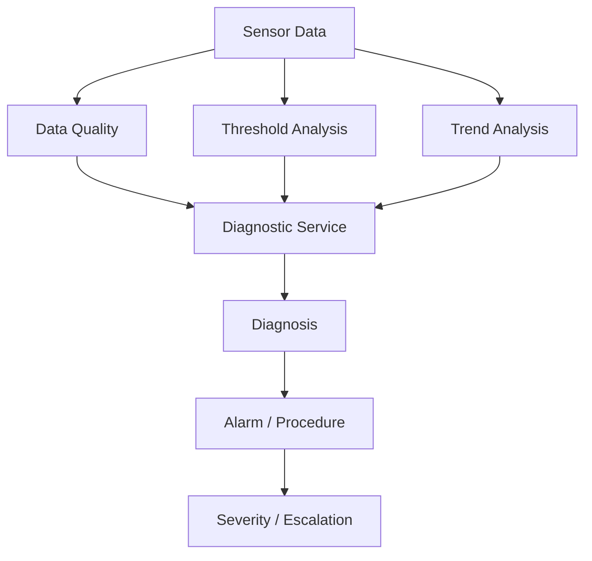
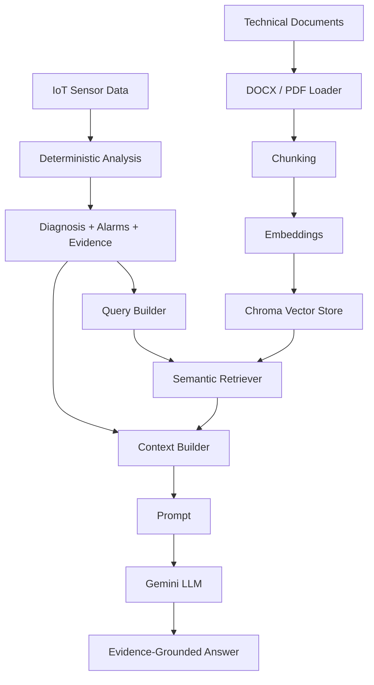

# IoT Maintenance Assistant — MVP

> **Durum:** Deterministik IoT analiz çekirdeği ve RAG + LLM karar destek hattı tamamlandı.  
> **Sıradaki ana aşama:** RAG servisinin FastAPI üzerinden erişilebilir hale getirilmesi.  
> **MVP kapsamı:** `PLANT_01 → STATION_01 → MOTOR_A`

---

## 1. Proje Amacı

Bu proje; endüstriyel IoT sensör verisini, varlık hiyerarşisini, teknik bakım dokümanlarını ve üretken yapay zekâyı bir araya getirerek **açıklanabilir ve kanıta dayalı bakım karar desteği** sunan bir MVP geliştirmeyi amaçlar.

Temel yaklaşım:

1. Sensör verisini oku.
2. Veri kalitesini doğrula.
3. Eşik ve alarm analizi yap.
4. Sensör trendlerini değerlendir.
5. Çoklu sensör desenlerinden deterministik teşhis üret.
6. Kritik durumlarda prosedür ve eskalasyon belirle.
7. Deterministik analiz sonucunu kullanarak RAG sorgusunu zenginleştir.
8. Teknik dokümanlar, bakım prosedürleri ve geçmiş benzer olaylar arasında semantic search yap.
9. Deterministik analiz ile retrieved kaynakları ortak bir context içinde birleştir.
10. LLM ile kaynaklı ve kanıta dayalı Türkçe cevap üret.

---

## 2. Proje Konumlandırması

Amaç bir IIoT, MES veya SCADA platformunu baştan geliştirmek değildir.

MVP odağı:

> **Asset-context-aware + deterministic-first + evidence-grounded maintenance assistant**

Sistemde LLM doğrudan ham sensör verisinden arıza teşhisi koymaz.

Temel prensip:

```text
Sensör verisi
      ↓
Deterministik analiz
      ↓
Teşhis + Alarm + Kanıt
      ↓
RAG
      ↓
Teknik kaynaklar
      ↓
LLM açıklaması
```

Bu nedenle sorumluluklar birbirinden ayrılmıştır:

- **Deterministik katman:** sensör değerlerini analiz eder ve teknik durumu belirler.
- **RAG katmanı:** ilgili teknik dokümanları ve geçmiş olayları getirir.
- **LLM katmanı:** mevcut kanıtları kullanıcıya anlaşılır biçimde açıklar.

LLM, deterministic analiz sonucunu değiştiren yeni bir teşhis üretmek için kullanılmaz.

---

## 3. Varlık Hiyerarşisi

```text
PLANT_01
├── STATION_01
│   └── MOTOR_A
└── STATION_02
    └── (MVP'de henüz makine yok)
```

Varlık ilişkileri `config/assets.yaml` üzerinden tanımlanır.

Bu yapı sayesinde servisler:

```text
Plant
  ↓
Station
  ↓
Machine
  ↓
Sensors / Data / Knowledge Base
```

bağlamını koruyarak çalışır.

---

## 4. Güncel Proje Yapısı

```text
FINAL_PROJECT/
├── backend/
│   ├── api/
│   │   └── routes/
│   │       ├── assets.py
│   │       ├── machines.py
│   │       └── analysis.py
│   │
│   ├── core/
│   │   └── config.py
│   │
│   ├── schemas/
│   │   ├── asset.py
│   │   ├── sensor.py
│   │   └── analysis.py
│   │
│   ├── services/
│   │   ├── asset_service.py
│   │   ├── data_service.py
│   │   ├── data_quality_service.py
│   │   ├── anomaly_service.py
│   │   ├── trend_service.py
│   │   ├── diagnostic_service.py
│   │   │
│   │   └── rag/
│   │       ├── __init__.py
│   │       ├── document_loader.py
│   │       ├── chunking_service.py
│   │       ├── embedding_service.py
│   │       ├── vector_store.py
│   │       ├── retriever.py
│   │       ├── query_builder.py
│   │       ├── context_builder.py
│   │       ├── prompt.py
│   │       ├── llm_service.py
│   │       ├── rag_chain.py
│   │       └── rag_service.py
│   │
│   └── main.py
│
├── config/
│   ├── assets.yaml
│   ├── thresholds.yaml
│   └── data_quality.yaml
│
├── data/
│   └── PLANT_01/
│       └── STATION_01/
│           └── MOTOR_A/
│               ├── motor_a_dummy_sensor_data.csv
│               └── motor_a_dummy_dataset.xlsx
│
├── knowledge_base/
│   └── PLANT_01/
│       └── STATION_01/
│           └── MOTOR_A/
│               ├── 01_Motor-A_Teknik_Kullanim_ve_Izleme_Kilavuzu.docx
│               ├── 02_Motor-A_Alarm_ve_Veri_Kalitesi_Katalogu.docx
│               ├── 03_Motor-A_Bakim_ve_Ilk_Mudahale_Prosedurleri.docx
│               ├── 04_Motor-A_Ariza_Teshis_ve_Yonlendirme_Rehberi.docx
│               └── 05_Motor-A_Gecmis_Olay_ve_Bakim_Kayitlari.docx
│
├── scripts/
│   ├── test_llm_connection.py
│   ├── test_rag_loader.py
│   ├── test_rag_chunking.py
│   ├── test_rag_embeddings.py
│   ├── test_rag_vector_store.py
│   ├── test_rag_retriever.py
│   ├── test_rag_context.py
│   ├── test_rag_service.py
│   ├── test_rag_prompt.py
│   └── test_rag_llm.py
│
├── storage/
│   └── chroma/
│
├── tests/
├── .env.example
├── .gitignore
├── README.md
└── requirements.txt
```

---

## 5. Deterministik IoT Analiz Akışı



Metin görünümü:

```text
Sensor Data
    ↓
Data Quality
    ↓
Threshold Analysis
    ↓
Trend Analysis
    ↓
Multi-Sensor Diagnosis
    ↓
Alarm + Procedure
    ↓
Severity / Escalation
```

---

## 6. Deterministik Backend İşlevleri

### Asset Service

- Plant bilgisi
- Station bilgisi
- Station altındaki makineler
- Machine → Station → Plant ilişkisi
- Veri ve knowledge base path çözümleme

### Data Service

- CSV sensör verisi okuma
- Son ölçüm
- Son N ölçüm
- Belirli timestamp'e kadar geçmiş ölçümler
- Ground-truth alanlarını runtime analiz girdisinden ayırma

### Data Quality

Desteklenen örnek veri kalitesi durumları:

- `DQ-SPIKE-01`
- `DQ-STUCK-01`
- `DQ-MISS-01`

### Threshold / Alarm

Motor-A demo eşikleri:

```text
Temperature
<70 normal | 70–<80 warning | ≥80 critical

Vibration
<3.5 normal | 3.5–<6 warning | ≥6 critical

Current
<19 normal | 19–<22 warning | ≥22 critical

Load
35–92 normal | >92 warning | ≥105 critical
```

> Bu eşikler gerçek üretici spesifikasyonları değildir. MVP ve sentetik veri senaryosu için tanımlanmıştır.

### Trend Analysis

İzlenen değişkenler:

- temperature
- vibration
- current
- load
- power

Trend sonuçları:

```text
increasing
stable
decreasing
```

### Diagnostic Service

Mevcut deterministic desenler:

- `cooling_degradation`
- `bearing_degradation`
- `overload`

Kritik durumlarda:

```text
MNT-MA-007
```

eskalasyonu üretilebilir.

---

## 7. Doğrulanan Sentetik Olaylar

| Incident | Beklenen Sonuç | Durum |
|---|---|---|
| INC-MA-001 | `cooling_degradation` | ✅ |
| INC-MA-002 | `bearing_degradation` | ✅ |
| INC-MA-003 | `overload` | ✅ |
| INC-MA-004 | `DQ-SPIKE-01` | ✅ |
| INC-MA-005 | `DQ-STUCK-01` | ✅ |
| INC-MA-006 | `DQ-MISS-01` | ✅ |
| INC-MA-007 | critical bearing + escalation | ✅ |

---

# 8. RAG Mimarisi

RAG katmanı deterministik IoT analizinin üzerine eklenmiştir.



Önemli fark:

```text
Klasik RAG:
User Question
    ↓
Retriever

Bu proje:
User Question
    +
Deterministic Analysis
    +
Diagnosis
    +
Alarms
    +
Procedure Codes
    +
Sensor Evidence
    ↓
Retriever
```

Bu yaklaşım retrieval sorgusunun yalnızca kullanıcı cümlesine değil, IoT analizinden elde edilen teknik bağlama da dayanmasını sağlar.

---

## 9. RAG Bileşenleri

### 9.1 Document Loader

Desteklenen dosya türleri:

```text
DOCX
PDF
```

Dokümanlar LangChain `Document` nesnelerine dönüştürülür.

DOCX belgelerinde paragraf ve tablolar okunur.

PDF belgelerinde sayfa bazlı yükleme yapılır ve sayfa metadata'sı korunur.

Image-only / scanned PDF belgeleri mevcut MVP kapsamında OCR ile işlenmez.

### Metadata

Her doküman/chunk asset bağlamını korur.

Örnek:

```json
{
  "plant_id": "PLANT_01",
  "station_id": "STATION_01",
  "machine_id": "MOTOR_A",
  "asset_type": "electric_motor",
  "document_id": "MA-MNT-001",
  "document_type": "maintenance_procedure",
  "source": "03_Motor-A_Bakim_ve_Ilk_Mudahale_Prosedurleri.docx",
  "page_number": null,
  "chunk_id": "MA-MNT-001_CHUNK_0003"
}
```

---

### 9.2 Chunking

Dokümanlar `RecursiveCharacterTextSplitter` ile parçalanır.

Mevcut ayarlar:

```text
chunk_size    = 900
chunk_overlap = 150
```

Her chunk benzersiz bir kimlik taşır:

```text
MA-MNT-001_CHUNK_0000
MA-MNT-001_CHUNK_0001
...
```

---

### 9.3 Embedding

Semantic search için local ve multilingual embedding modeli kullanılır:

```text
sentence-transformers/paraphrase-multilingual-MiniLM-L12-v2
```

Model local olarak çalışır ve embedding'ler normalize edilir.

Embedding modelinin aynı process içinde tekrar tekrar yüklenmesini önlemek için cache kullanılır.

---

### 9.4 Vector Store

Vector store olarak:

```text
Chroma
```

kullanılır.

Persistent storage:

```text
storage/chroma/
```

Collection:

```text
iot_maintenance_kb
```

Retrieval sırasında `machine_id` metadata filtresi kullanılarak farklı varlıkların bilgi tabanlarının birbirine karışması engellenir.

---

### 9.5 Deterministic-Aware Query Builder

Kullanıcı sorusu retrieval öncesinde deterministik analizle zenginleştirilir.

Örnek:

```text
Motor-A neden kritik durumda ve hangi bakım işlemleri yapılmalı?

Overall status: critical
Diagnosis: bearing_degradation
Confidence: high
Active alarms: ALM-TEMP-01, ALM-VIB-02, ALM-COMB-BRG-01
Recommended procedure: MNT-MA-002
Escalation procedure: MNT-MA-007
Evidence:
temperature increasing
vibration increasing
vibration 8.231 mm/s
```

Böylece retriever yalnızca doğal dil sorusuna değil, sistemin mevcut teknik durumuna göre de kaynak arar.

---

### 9.6 Context Builder

Context builder üç ana bilgi grubunu birleştirir:

```text
Machine Context
        +
Deterministic Analysis
        +
Retrieved Knowledge
```

Örnek yapı:

```text
=== USER QUESTION ===

...

=== MACHINE CONTEXT ===

Plant
Station
Machine
Asset Type

=== DETERMINISTIC ANALYSIS ===

Diagnosis
Alarms
Procedure
Escalation
Sensor Evidence

=== RETRIEVED KNOWLEDGE ===

Document ID
Document Type
Chunk ID
Source
Content
```

---

### 9.7 Prompt Guardrails

LLM için kullanılan system prompt aşağıdaki prensipleri uygular:

- Deterministik analiz birincil teknik gerçek kabul edilir.
- LLM yeni bir arıza teşhisi üretmez.
- Retrieved dokümanlar teşhisi değiştirmek için değil, açıklamak ve desteklemek için kullanılır.
- Dokümanda bulunmayan üretici bilgisi, limit veya prosedür uydurulmaz.
- Güvenilir olmayan veride kesin fiziksel arıza iddiası yapılmaz.
- Kritik durumda insan onayı olmadan fiziksel kontrol komutu önerilmez.
- Mevcut sensör değerleri retrieved dokümanlara yanlış biçimde kaynaklandırılmaz.
- Teknik kaynaklar `Document ID` ve `Chunk ID` ile gösterilir.

---

### 9.8 LLM

LLM katmanı LangChain üzerinden oluşturulur.

Mevcut varsayılan model:

```text
google_genai:gemini-3.5-flash-lite
```

Model seçimi environment variable üzerinden değiştirilebilir:

```text
RAG_MODEL
```

LLM zinciri:

```text
ChatPromptTemplate
        ↓
Gemini
        ↓
StrOutputParser
        ↓
Türkçe cevap
```

---

## 10. Uçtan Uca RAG + LLM Akışı

```text
MOTOR_A + Timestamp + Question
              ↓
        Sensor History
              ↓
        Data Quality
              ↓
      Threshold Analysis
              ↓
        Trend Analysis
              ↓
    Deterministic Diagnosis
              ↓
 Diagnosis + Alarm + Procedure
              ↓
 Deterministic-Aware Query
              ↓
       Semantic Retrieval
              ↓
 Technical Procedure + Alarm Catalog
       + Similar Incident
              ↓
        Context Builder
              ↓
            Prompt
              ↓
             LLM
              ↓
   Evidence-Grounded AI Answer
```

---

## 11. Doğrulanan RAG + LLM Örneği

Test timestamp'i:

```text
2026-07-27 20:00:00
```

Deterministik analiz:

```text
Data Quality: ok
Overall Status: critical
Diagnosis: bearing_degradation
Confidence: high

Active Alarms:
- ALM-TEMP-01
- ALM-VIB-02
- ALM-COMB-BRG-01

Temperature: 79.20 °C
Vibration: 8.231 mm/s

Recommended Procedure:
MNT-MA-002

Escalation:
MNT-MA-007
```

Örnek kullanıcı sorusu:

```text
Motor-A neden kritik durumda ve hangi bakım işlemleri yapılmalı?
```

RAG sistemi bu analiz sonucunu kullanarak:

- kritik titreşim alarm bilgisini,
- rulman bakım prosedürünü,
- eskalasyon prosedürünü,
- geçmiş benzer rulman olayını

bilgi tabanından retrieve edebilmektedir.

LLM cevabında mevcut sensör değerleri **Deterministik Analiz** kaynağıyla; eşikler, prosedürler ve teknik açıklamalar ise ilgili doküman ve chunk kimlikleriyle gösterilir.

---

## 12. API

Swagger:

```text
http://127.0.0.1:8000/docs
```

### System

```http
GET /
GET /health
```

### Assets

```http
GET /api/v1/plants/{plant_id}
GET /api/v1/plants/{plant_id}/stations
GET /api/v1/stations/{station_id}
GET /api/v1/stations/{station_id}/machines
```

### Machines

```http
GET /api/v1/machines/{machine_id}
GET /api/v1/machines/{machine_id}/latest
```

### Analysis

```http
GET /api/v1/machines/{machine_id}/analysis/latest
GET /api/v1/machines/{machine_id}/data-quality/latest
GET /api/v1/machines/{machine_id}/data-quality/at
GET /api/v1/machines/{machine_id}/trends/at
GET /api/v1/machines/{machine_id}/diagnostics/at
```

### Assistant

RAG + LLM servis katmanı tamamlanmıştır.

FastAPI assistant endpoint'i henüz eklenmemiştir.

Planlanan endpoint:

```http
POST /api/v1/machines/{machine_id}/assistant/ask
```

---

## 13. Kurulum

### Virtual Environment

Windows:

```powershell
python -m venv .venv
.venv\Scripts\Activate.ps1
```

Bağımlılıkları yükle:

```powershell
pip install -r requirements.txt
```

---

### Environment Variables

`.env.example` dosyasını `.env` olarak kopyala:

```powershell
Copy-Item .env.example .env
```

`.env`:

```env
GOOGLE_API_KEY=your_google_api_key_here
RAG_MODEL=google_genai:gemini-3.5-flash-lite
```

Gerçek API key Git repository'sine eklenmemelidir.

---

## 14. Uygulamayı Çalıştırma

Backend:

```powershell
fastapi dev backend/main.py
```

Swagger:

```text
http://127.0.0.1:8000/docs
```

Health check:

```text
http://127.0.0.1:8000/health
```

---

## 15. RAG Testleri

### Document Loader

```powershell
python scripts/test_rag_loader.py
```

### Chunking

```powershell
python scripts/test_rag_chunking.py
```

### Embedding

```powershell
python scripts/test_rag_embeddings.py
```

### Vector Store

```powershell
python scripts/test_rag_vector_store.py
```

### Retriever

```powershell
python scripts/test_rag_retriever.py
```

### Query + Context

```powershell
python scripts/test_rag_context.py
```

### Deterministik Backend + RAG

```powershell
python scripts/test_rag_service.py
```

### Prompt

```powershell
python scripts/test_rag_prompt.py
```

### LLM Connection

```powershell
python scripts/test_llm_connection.py
```

### RAG + LLM End-to-End

```powershell
python scripts/test_rag_llm.py
```

---

## 16. Geliştirme Durumu

### Backend Foundation

- [x] FastAPI
- [x] `/health`
- [x] Modüler router yapısı
- [x] Service katmanı
- [x] Core config
- [x] Pydantic schemas
- [x] Swagger gruplaması

### Asset Hierarchy

- [x] `PLANT_01`
- [x] `STATION_01`
- [x] `MOTOR_A`
- [x] `STATION_02` placeholder
- [x] `assets.yaml`
- [x] Asset API

### Sensor Data

- [x] CSV
- [x] Excel reference dataset
- [x] Latest measurement
- [x] Recent measurements
- [x] Historical timestamp query
- [x] Ground-truth alanlarını runtime analizinden ayırma

### Data Quality

- [x] Missing
- [x] Stuck
- [x] Spike
- [x] `INC-MA-004`
- [x] `INC-MA-005`
- [x] `INC-MA-006`

### Threshold / Trend / Diagnosis

- [x] Temperature threshold
- [x] Vibration threshold
- [x] Current threshold
- [x] Load threshold
- [x] Trend service
- [x] Cooling degradation
- [x] Bearing degradation
- [x] Overload
- [x] Critical escalation
- [x] `INC-MA-001`
- [x] `INC-MA-002`
- [x] `INC-MA-003`
- [x] `INC-MA-007`

### RAG

- [x] `backend/services/rag/`
- [x] DOCX loader
- [x] PDF loader
- [x] PDF page metadata
- [x] Document metadata
- [x] Chunking
- [x] Chunk metadata
- [x] Local multilingual embedding
- [x] Embedding model cache
- [x] Chroma vector store
- [x] Chroma persistence
- [x] Semantic retriever
- [x] Machine metadata filtering
- [x] Procedure retrieval
- [x] Historical incident retrieval
- [x] Deterministic-aware query builder
- [x] Context builder
- [x] ChatPromptTemplate
- [x] Prompt guardrails
- [x] Gemini LLM integration
- [x] LCEL chain
- [x] Evidence-grounded answer
- [x] Document / Chunk source attribution
- [x] End-to-end RAG + LLM test
- [ ] RAG API endpoint

### Frontend / Layout — Later

- [ ] Plant → Station → Machine navigation
- [ ] Machine detail
- [ ] Sensor charts
- [ ] Status / alarm cards
- [ ] Chat assistant
- [ ] RAG kaynak gösterimi
- [ ] Factory layout upload
- [ ] Station işaretleme
- [ ] Machine işaretleme
- [ ] Heatmap
- [ ] Machine click → diagnosis context

### Optional / Advanced

- [ ] Multi-machine dataset
- [ ] Multi-station dataset
- [ ] Database
- [ ] Real IoT API
- [ ] Streaming
- [ ] Maintenance ticket creation
- [ ] OCR for scanned PDFs
- [ ] Hybrid search
- [ ] Re-ranking
- [ ] Agent orchestration
- [ ] 3D factory view

---

## 17. Şu Anda Nerede Kaldık?

Aşağıdaki ana katmanlar tamamlandı:

```text
Deterministic IoT Analysis      ✅
        ↓
RAG Retrieval                   ✅
        ↓
Evidence-Aware Context          ✅
        ↓
Prompt Guardrails               ✅
        ↓
Gemini LLM                      ✅
        ↓
Evidence-Grounded Answer        ✅
```

### Sıradaki kesin adım

```text
RAG Service
    ↓
FastAPI Assistant Endpoint
    ↓
POST /api/v1/machines/{machine_id}/assistant/ask
```

Bu endpoint tamamlandıktan sonra frontend/chat arayüzü doğrudan mevcut RAG + LLM pipeline'ını kullanabilecektir.

---

## 18. MVP Sınırlamaları

Mevcut proje bir demonstrasyon ve karar destek MVP'sidir.

- Sensör verisi sentetiktir.
- Teknik dokümanlar demo amaçlı hazırlanmıştır.
- Threshold değerleri gerçek üretici limitleri değildir.
- Fiziksel makine kontrolü gerçekleştirilmez.
- Kritik kararlar insan onayına bırakılır.
- LLM deterministik teşhisin yerine geçmez.
- OCR henüz desteklenmemektedir.
- Hybrid retrieval ve re-ranking henüz eklenmemiştir.
- Mevcut veri kapsamı tek makine (`MOTOR_A`) üzerindedir.

---

## 19. Hedef MVP

```text
Factory / Asset Context
          ↓
     Sensor Data
          ↓
 Deterministic Analysis
          ↓
 Diagnosis + Evidence
          ↓
        RAG
          ↓
Technical Documentation
+
Historical Incidents
          ↓
Evidence-Grounded AI Answer
          ↓
        API
          ↓
   User Interface
```

---

_Last updated: 11 August 2026_